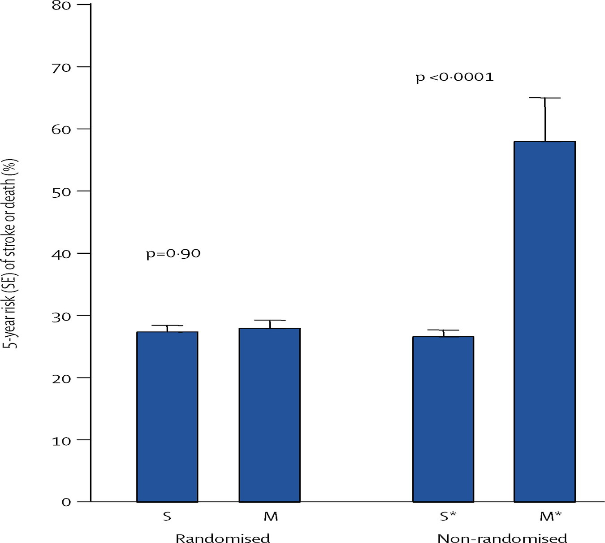

# Why clinical observations can be misleading {#observations}

```{r, echo=F, message=F, warning=F}

library(tidyverse)
library(ggpubr)
library(ggalluvial)
library(diagram)

library(DiagrammeR)
library(DiagrammeRsvg)
library(magrittr)
library(rsvg)

library(kableExtra)
library(knitr)

#nb to preview this chapter, preview_chapter("02-Clinical-observations")

```
`r include_image("images/logo_alone_new.png")`

<p id="vignette">*Janice, a SLT, has recently started using a parent-based approach with late-talking 2-year-olds in her practice. Parents are encouraged to make video recordings of interactions with their child, which are then analysed with the therapist, who notes ways of making the interaction more contingent on the child's interests and communicative attempts. She wants to evaluate what she is doing. A colleague of hers, Anna, who has a similar caseload,  is sceptical about whether Janice's approach is cost-effective. Anna uses a watchful waiting approach with children this young. Janice and Anna agree to do a study using the same pre- and post-intervention assessments so that they can evaluate the impact of Janice's approach.*</p>

<p id="vignette">*Stephen notes that some aphasic patients referred to his clinic talk glowingly about a commercially available 'brain-based learning' programme, MyLangBooster. He wants to know whether he should be recommending this programme to other clients, so he carries out a comparison of patients who used MyLangBooster and those who did not.*</p>

<p id="vignette">*Dorothy, a researcher, had a grant for a study predicting outcomes of 4-year-olds who had poor language skills, some of whom had received intervention with SLT services. She saw the same group of 83 children at ages 4, 4.5 and 5.5 years, and noted that their outcomes were very variable. Some children had caught up with their peer group by the final assessment, whereas others had persistent problems. When she presented the results at a conference, a person in the audience suggested that she should do an analysis to see if the amount of intervention was a factor influencing outcomes.*</p>

All of these vignettes illustrate **observational studies**: ones where we use naturalistic data rather than exerting any experimental control over who gets an intervention. The last one, as you may have guessed, is a true story – experience with a longitudinal study by Bishop and Edmundson (1987). This gives a very clear illustration of the perils of observational studies.

Results on the relationship between intervention and outcome in this sample were disquieting to speech and language therapists: the children who had the most intervention had the worst outcomes. Did that mean that intervention was actually harming children? Well, it's possible – as we will see in Chapter \@ref(controls), it is dangerous to assume that all effects of intervention are benign. But there is a much simpler explanation for this topsy-turvy result: the children who received intervention were different from those who didn't – in general they had more severe problems to start with. This makes sense: if a child is referred to speech and language therapy services, then the therapist makes a judgement about which ones to intervene with, and these are likely to be different from those who are discharged or simply reviewed after a few months. If, as appears to have been the case in the Bishop and Edmundson study in the 1980s, therapists work most with the more serious cases, then there is a **confound** between severity of language problems and receipt of therapy, and this can make intervention appear ineffective. Bias can also work in the opposite direction: a contemporary concern in the UK is that therapists are being encouraged to focus their efforts on children who can be discharged after a short block of treatment, which means they tend to work with children with milder problems [@ebbels2019]. This will create the opposite impression – therapy which is actually ineffective may appear effective. The basic problem is the same: treated and untreated groups are not comparable, and so comparing them will give misleading results. 

Stephen's study is equally problematic. Here we are comparing a self-selected group of patients with his regular caseload. Those who tried MyLangBooster may be more motivated to improve than other patients. They may have more money, so they can afford to pay for the programme. Or they may be more desperate – having tried other interventions that failed to make a difference.  Furthermore, Stephen may only hear from those who felt they improved, and be unaware of other patients who tried it but then dropped out because they obtained disappointing results. It is almost never a good idea to base an evaluation of an intervention on a study of self-selected enthusiasts. There are just too many potential confounds that could cause bias.

What about the case of Janice and Anna? This may seem less problematic, since the two therapists have similar caseloads, and the decision about therapy is based on therapist preference rather than child characteristics. Here again, though, the comparison has the potential to mislead. If baseline and post-intervention assessments are done using the same measures, then it is at least possible to check if the children in the two practices are similar at the outset. But there would still be concerns about possible differences between the therapists and their practices that might be influencing results. Maybe Anna rejects parent-based intervention because she knows that most of the parents in her practice have full-time jobs and would not be willing or able to devote time to attending sessions to analyse videos. Maybe Janice is an exceptionally skilled therapist who would obtain good outcomes with children regardless of what she did. Perhaps her enthusiasm for a parent-based approach contrasts with Anna's more downbeat attitude, and this has an influence on parent and/or child. In sum, there is scope for non-specific treatment effects to exert an impact. If Janice finds better outcomes than Anna, despite both therapists doing their best to ensure that the participating children and parents from their practices are similar, then it is reasonable to say that this is useful information that would provide justification a more formal comparison. But it is not conclusive and cannot substitute for the kind of experimental study discussed in the next chapter.  

```{r confounder2,echo=F,warning=F,message=F,fig.cap="Path diagram showing confounder influence",fig.width=5,fig.height=4}

data <- c(0, 0,0,
          "' '", 0, 0, 
          "' '",0, 0)
M<- matrix (nrow=3, ncol=3, byrow = TRUE, data=data)
plot<- plotmat (M, pos=c(1,2), 
                name= c( "Confounder","Intervention", "Outcome"), 
                box.type = "ellipse", box.size = 0.15, box.prop=0.5,  curve=0)

Confounder <- plot$comp[1,]
Intervention <- plot$comp[2,]
Outcome <- plot$comp[3,]

 m2 <- Outcome 
 m1 <- Intervention
 m1[1] <- m1[1] + plot$radii[1,1]
 m2[1] <- m2[1] - plot$radii[1,1]
# mid <- straightarrow (to = m1, from = m2, arr.type = "triangle",
# arr.pos = 0.95, lwd = 2,lty=2)
  mid2 <- straightarrow (to = m2, from = m1, arr.type = "triangle",
 arr.pos = 0.95, lwd = 2,lty=2)
 
```
Things that may affect outcome and that differ between intervention and control groups are known as **confounders**. The relationship between confounders and other variables can be depicted in the kind of path diagram shown in Figure \@ref(fig:confounder2), where an arrow indicates the direction of a causal influence. Thus the confounder on the one hand influences who gets intervention, and on the other hand affects the outcome. A direct relationship from intervention to outcome is shown as a dashed arrow, to indicate that it is uncertain whether there is a genuine benefit from intervention. Even if there is no such influence, the confounder can give the impression that the intervention is effective, because it induces a positive association between intervention and outcome. 

Consider possible confounders in the following examples: Does long-term use of hormone replacement therapy carry risks or benefits? Does excessive use of computer games in teenagers cause social isolation? Will your life be extended if you ate more cabbage? Here are just a few possibilities:  Woman who decide to continue to use HRT may have more severe menopausal symptoms than those who do not. Excessive use of computer games may be a consequence rather than a cause of lack of social engagement, and those who eat cabbage may adopt healthier lifestyles than those who don't.  

Many reports in the media about things that are good or bad for you are based on observational rather than experimental data. In some cases, it is hard to see how other types of data could be collected: are we really going to succeed in allocating adolescents to a regime of non-stop computer games, or to force people to start eating cabbage? Indeed, some associations that are now well-established, such as the link between cigarette smoking and cancer, were discovered from observational data, and could not be studied any other way. But where the interest is in interventions administered by a therapist, then it should not be necessary to rely on observational studies, and, as we have shown, to do so can lead to flawed conclusions.

There is a great deal of work on methods for analysing and interpreting observational data (see, e.g., @hernan2018), but, given the difficulty of identifying causal influences from such evidence, we will not say any more about this topic, but rather focus on experimental approaches that allow us to minimise the role of confounders.


## Class exercise

1. Find a newspaper report of a factor that is reported to be a risk or benefit to health. Is it based on an experimental or observational study? Can you identify potential sources of bias?  

2. The figure below is a medical example taken from @rothwell2005, and shows the rate of stroke or death at 5 year follow-up in at-risk patients who either did or did not undergo a surgical procedure known as endarterectomy. 

```{r rothwellfig, fig.align="center", echo=FALSE, out.height="30%",out.width="70%"}

``` 

The two bars on the left show results obtained in an experimental study where assignment to surgery was done at random, whereas the bars on the right show results for patients who were not included in a trial. What do these plots show, and how might it be explained?


