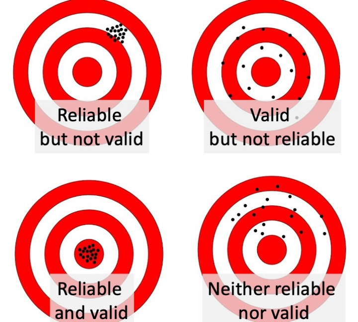

# How to select an outcome measure {#reliability}

```{r, echo=F, message=F, warning=F, fig.width=8,fig.height=4}

library(tidyverse)
library(ggpubr)
library(MASS)
library(kableExtra)
library(knitr)
library(flextable)
library(cowplot)


```
`r include_image("images/logo_alone_new.png")`

Suppose you want to evaluate the effectiveness of a parent-based intervention for improving communication in three-year-olds with poor language skills. You plan to assess their skills before the intervention, immediately after the intervention, and again six months later. The initial measurement period is known as the baseline – because it acts against as a reference point against which improvement can be measured.

There are many measures you could choose: the child's mean length of utterance (MLU) from a language sample, scores on a direct assessment such as preschool CELF [@wiig2006], the parent's response to language items on a screening inventory such as the Ages and Stages Questionnaire [@bricker1999]. You may wonder whether you should include as many measures as possible to ensure you cover all bases. However, as we shall see in Chapter \@ref(phacking), if you measure too many things, you run the risk of getting spurious results, so it is useful to specify a primary outcome measure – the one you would put your money on as most likely to show the effect of interest, if you were a betting person. 

The key questions to ask are:

1.	Is the measure reliable?
2.	Is it valid? i.e., does it measure what I want to measure?
3.  Are there norms?
4.	Is it sensitive?
5.	Is it practical?


#### Types of numerical measurement{-}
<p id="custom"> Results from an measurement in an intervention study are typically represented as numbers, but different types of measurement have different properties.
- **Nominal**, also known as categorical, data is just used to designate qualitative information. For instance, we may record data as 1, 2 or 3 to indicate the school that a child attends. The order of the numbers here is arbitrary, and the information could equally well be represented by letters, e.g. school A, B and C. It would make no sense to perform numerical operations such as addition and subtraction on such numbers.  
- For **ordinal** data, the order of the numbers matters. For instance, if we had a 3 point scale of fluency, a person with a score of 3 would be more fluent than one with a score of 2, who would in turn be more fluent than a person who scored 1. In effect ordinal data describes ordered categories, but again, you can't sensibly perform arithmetical operations on such data, though you can specify a median or mode to represent the most typical score.  
- Data on an **interval scale** are commonly found in behavioural studies. Here, the numbers are equally spaced, so the difference between 1 and 2 is the same quantity as the difference between 3 and 4. With interval data, we can compute an average and conduct many types of statistical test that are not possible with ordinal data.  
- The most sophisticated type of numerical measurement is the **ratio scale**, which has all the properties of interval data, plus it has a meaningful zero point. Weight, height,  length and duration are all measured on a ratio scale: a zero measurement indicates there is no weight, height, length or duration. On this kind of scale, one can meaningfully interpret multiplication - e.g. 4 kg is twice as much as 2 kg.  
Most commonly used statistical procedures assume data is at least on an interval scale.  If you are using ordinal data, then a different kind of test using *nonparametric* statistics is required. </p>


## Reliability
```{r darts, echo=F,  fig.width=8,fig.height=4,fig.cap='Reliability and validity illustrated as a sharpshooter hitting a target'}

#Not actually a dartboard.....
```


<!-- DB comment.copyright status?: there are multiple versions of this type of thing online, but it's hard to know who first came up with the idea. There's a nice big version in Poldrack's book that we could use-->

You may be surprised to see reliability at the top of the list. Surely validity is more important? Well, yes and no. As shown in Figure \@ref(fig:darts), there's not much point in having a measure that is valid unless it is also reliable: what we want is a measure that hits the bullseye, in terms of measuring what we are aiming to measure, not just on average, but consistently. A measure that is valid but not reliable is worse than useless in an intervention study, so we put reliability at the top of the list.

So what is reliability? This brings us back to the issue of random error or "noise": quite simply you want a measure that is as accurate as possible, with minimal influence from random, unwanted sources of variation. One way to assess this is to apply the same measure on two occasions (without any intervention between) to see how similar they are, computing an index of "test-retest reliability". To assess this, we repeat the measurement with a sample of individuals seen on two occasions close in time (i.e. before we expect any change due to maturation or intervention). Test-retest reliability is often quantified by the correlation coefficient, demonstrated in Figure \@ref(fig:correlationfig).  

```{r correlationfig, echo=F,message=F,warning=F,fig.width=6,fig.height=6,fig.cap="The correlation coefficient is a statistic that takes the value of zero when there is no relationship between two variables, 1 whether there is a perfect relationship, and -1  when there is an inverse relationship. If you draw a straight line through the points on the graph, then if all points fall exactly on the line, the correlation is 1, indicating that you can predict perfectly a person's score on Y if you know their score on X."}

set.seed(123)
plot_cors<-function(r=1)
{
cor_data<-as.data.frame(MASS::mvrnorm(40,c(50,50),Sigma=matrix(c(20,r,r,20),2,2)))
colnames(cor_data)<-c("x","y")
return(cor_data)
}
R_cors<-20*c(1,0.8,0.25,0)

myC<-paste0("C",1:4)
for(i in R_cors)
{
assign(myC[which(R_cors==i)],plot_cors(i) %>% ggplot(aes(x=x,y=y))+geom_point(alpha=0.75)+geom_smooth(method = "lm", se = FALSE, color = "red") + theme_bw() + xlab("Time 1 Score") + ylab("Time 2 Score")+ggtitle(paste0("r = ",R_cors[which(R_cors==i)]/20))+xlim(40,60)+ylim(40,60)+theme(text=element_text(size=16)))
}
ggarrange(plotlist = mget(paste0("C",1:length(R_cors))),ncol=2,nrow=2)
```

#### Correlation as an index of reliability {-}
<p id="custom">Although the correlation coefficient is widely used to index reliability, it can be misleading because it just reflects agreement in the rank ordering of two measures. It would be possible to get a high correlation even if the task showed practice effects, so that scores at time 2 were substantially higher than those at time 1. For that reason, the intraclass correlation coefficient (ICC) is preferable, as this reflects agreement in absolute scores. In practice, however, the two types of correlation give similar values unless there is a substantial difference in means between the two occasions of measurement.  For more explanation see https://dapa-toolkit.mrc.ac.uk/concepts/statistical-assessment.
</p> 

So how reliable should a measure be? Most psychometric tests report reliability estimates, and a good test is expected to have test-retest reliability of at least .8. But be careful in interpreting such estimates, as you need also to consider the age range on which the estimate is based. 

```{r reliability-by-age,echo=F,include=T,fig.width=6,fig.height=6,fig.cap="Age range can affect reliability"}
mysigma <- matrix(c(1,.3,.3,1),nrow=2)
myn <- 40
basedata <- mvrnorm(n=myn,mu=c(0,0),Sigma=mysigma,empirical=TRUE)
data3 <-basedata*15+40
data4 <-basedata*15+70
data5 <-basedata*15+100
alldata<-data.frame(rbind(data3,data4,data5))
alldata$age<-c(rep(3,myn),rep(4,myn),rep(5,myn))
alldata$age<-factor(alldata$age)
allcor <- round(cor(alldata$X1,alldata$X2),2)
mycolours<-c('red','blue','purple')

ggplot(alldata,aes(x=X1,y=X2))+
  geom_point(aes(colour=age))+
   scale_fill_discrete(name = "Age (yr)", labels = c("3", "4", "5"))+
       theme_bw() +
       xlab("Time 1 Score") +
       ylab("Time 2 Score") +
       ggtitle(paste0("Overall r = ",allcor)) + scale_colour_manual(name="Age (yr)",values=c('red','blue','purple'))
   

```

Figure \@ref(fig:reliability-by-age) shows how a test of vocabulary size that looks highly reliable when considered across the full age range from 3 to 5 years is really not very reliable when we just look at a single year-band. Although the overall correlation for Time 1 and Time 2 is .81, within each age band it is only .3. This is because the index of reliability, the correlation coefficient, is affected by the range of scores: older children tend to score higher than younger children, and this is reflected in the correlation. If your study was focused just on 3-year-olds, you'd really want it to be reliable within that age range.

The topic of reliability is covered more formally in classical test theory [@lord1968] and subsequent developments from this. These involve a mathematical approach that treats an observed test score as the sum of a "true" effect (i.e. what you want to measure) plus random error. The lower the reliability, the greater the random error, and the harder it is to detect the true effect of intervention against the background of noise.  


#### Item Response Theory {-}
<p id="custom"> Most widely-used language assessments have been developed using methods from classical test theory [@denman2017]. However, mathematical treatments of test development have come a long way in the past 20 years, and an approach known as Item Response Theory is now generally preferred for developing more precise and valid instruments [@reise2005]. </p>  


We have focused on test-retest reliability as this is the most relevant form of reliability in intervention studies. If you plan to use the same measure at baseline and after intervention, then what you need to know is how much variation in that measure you might expect if there were no effect of intervention. There are other reliability indices that are sometimes reported with psychometric tests. In particular split-half reliability and internal consistency (Cronbach's alpha), both of which consider the extent to which a score varies depending on the specific items used to calculate it. For instance, we could assess split-half reliability for mean length of utterance (MLU) by computing it separately for all the odd-numbered utterances and the even-numbered utterances. Although this gives useful information, it is likely to differ from test-retest reliability, because it does not take into account fluctuations in measurement that relate to changes in the context or the child's state. 

It is much easier to compute measures of internal consistency than to do the extra testing that is needed to estimate test-retest reliability, and some published psychometric tests only provide that information. 

A recent review by @denman2017 looked at psychometric properties, including reliability, of 15 comprehensive language assessments for children aged 4-17 years. Although all but one reported test-retest reliability that was rated as good, the methodological quality of the psychometric data was deemed questionable for all but two tests. 


## Validity

A modification of a popular adage is "If a thing is not worth doing, it's not worth doing well." This applies to selection of outcome measures: you could have a highly reliable measure, but if it is not measuring the right thing, then there's no point in using it. 

Deciding what is the "right thing" is an important part of designing any invention study, and it can be harder than it appears at first sight. The answer might be very different for different kinds of intervention. One consideration of major importance when dealing with speech and language assessments is the cultural context. 

### Cultural factors  
I (Dorothy) remember my first encounter with a popular receptive vocabulary test, the Peabody Picture Vocabulary Test, where the task was to match a spoken word to one of four pictures in an array. An early item was "caboose", a word I had never encountered, but which was presumably familiar to children in the USA. Another American reading assessment required children to find words that sounded the same, and treated 'aunt' and 'ant' as homophones. Conversely, in my standard British English, the words "arm" and "calm" have the same ending, whereas to speakers of Scots, Irish and American English, the 'r' is pronounced. In some dialects, low intensity morphemes may be omitted, and it's acceptable to say "She my sister" rather than the standard English "She's my sister", or to say "I done my homework', rather than "I've done my homework". And if we move to consider pragmatics and language usage, there can be wide variability from culture to culture in what is deemed acceptable or odd in terms of what is said and how it is said. 

It is crucial to be sensitive to such issues. Quite simply, an assessment that categorises nonstandard language as impairment is invalid. Terms such as language impairment or disorder are only appropriate when the individual is recognised as having problems within their own cultural community. We therefore need to use culturally appropriate assessments, that do not confuse language difficulties with normal variation. While that is obvious advice to give, there may be a lack of suitable assessments available, in which case some modification of existing assessments may be the only option. This should be done in consultation with someone who is a member of the relevant culture. If modifications are made, then normative data (see below) should be interpreted with extreme caution. 


### Generalisability of results to other outcomes: the concepts of far and near transfer
Generalisability is an issue that is particularly relevant to the first and third vignettes from Chapter \@ref(intro), word-finding intervention for aphasia, and the classroom-based vocabulary intervention. These vignettes illustrate interventions that have a specific focus.  This means we can potentially tie our outcome measures very closely to the intervention: we would want to measure speed of word-finding in the first case, and vocabulary size in the second. 

There is a risk, though, that this approach would lead to trivial findings. If we did a word-finding training with an aphasic client using ten common nouns and then showed that his naming had speeded up on those same ten words, this might give us some confidence that the training approach worked (though we would need appropriate controls, as discussed in later chapters). However, ideally, we would want the intervention to produce effects that generalised and improved his naming across the board. Similarly, showing that a teaching assistant can train children to learn ten new animal names is not negligible, but it doesn't tell us whether this approach has any broader benefits.

These issues can be important in situations such as phonological interventions, where there may be a focus on training the child to produce specific contrasts between speech sounds. If we show that they master those contrasts but not others, this may give us confidence that it was the training that had the effect, rather than spontaneous maturation (see Chapter \@ref(nonspecific)), but at the same time we might hope that training one contrast would have an impact on the child's phonological system and lead to improved production of other contrasts that were not directly trained.

These examples illustrate the importance of testing the impact of intervention not only on particular training targets, but also on other related items that were not trained. This is something of a two-edged sword. We may hope that treatment effects will generalise, but if they do, it can be difficult to be certain that it was our intervention that brought about the change. The important thing when planning an intervention is to think about these issues and consider whether the mechanism targeted by the treatment is expected to produce generalised effects, and if so to test for those. 

The notion of generalisation assumes particular importance when the intervention does not directly target skills that are of direct relevance to everyday life. An example is [CogMed working memory training](www.cogmed.com), a computer-based intervention that has been promoted as a way of improving children's working memory and intelligence. The child plays games that involve visual tasks that tax working memory, with difficulty increasing as performance improves. Early reports maintained that training on these tasks led to improvement on nonverbal intelligence. However, more recent literature has challenged this claim, arguing that what is seen is "near transfer" – i.e. improvement in the types of memory task that are trained – without any evidence of "far transfer" – i.e. improvement in other cognitive tasks [@aksayli2019]. This is still a matter of hot debate, but it seems that many forms of "computerised brain training" that are available commercially give disappointing results. If repeatedly doing computerised memory exercises only improves the ability to do those exercises, with no "knock on" effects on everyday functioning, then the value of the intervention is questionable. It would seem preferable to time to train skills that would be useful in everyday life.

### Functional outcomes vs test scores

In the second vignette we have an intervention where issues of far and near transfer are not so relevant, as the intervention does not target specific aspects of language, but rather aims to modify the parental communicative style in order to provide a general boost to the child's language learning and functional communication. This suggests we need a rather general measure; we may to consider using a standardized language test because this has the advantage of providing a reasonably objective and reliable approach to measurement. But does it measure the things that clients care about? Would we regard our intervention as a failure if the child made little progress on the standardized test, but was much more communicative and responsive to others? Or even if the intervention led to a more harmonious relationship between parent and child, but did not affect the child's language skills?

We might decide that these are important key outcomes, but then we have to establish how to measure them. In thinking about measures, it is important to be realistic about what one is hoping to achieve. If, for instance, the therapist is working with a client who has a chronic long-term problem, then the goal may be to help them use the communication skills they have to maximum effect, rather than to learn new language. The outcome measure in this case should be tailored to assess this functional outcome, rather than a gain on a measure of a specific language skill. 

If you are devising an intervention study, it can be useful to consult with representatives of the clinical group you plan to work with, to see what they regard as the most useful outcomes. This kind of stakeholder engagement can be valuable in increasing the impact of intervention research - see @forsythe2019 for examples.  

### Subjectivity as a threat to validity

In later chapters we will discuss various sources of bias that can affect studies, but one that crops up at the measurement stage is the impact of so-called "demand characteristics" on subjective ratings. Consider, for a moment, how you respond when a waiter comes round to ask whether everything was okay with your meal. There are probably cultural differences in this, but the classic British response is to smile and say it is fine even if it was disappointing. We tend to adopt a kind of "grade inflation" to many aspects of life when asked to rate them, especially if we know the person whose work we are rating.  

In the context of intervention, people usually want to believe that interventions are effective and they don't want to appear critical of those administering the intervention, and so ratings of language are likely to improve from baseline to post-test, even if no real change has occurred. This phenomenon has been investigated particularly in situations where people are evaluating treatments that have cost them time and money (because of a phenomenon known as cognitive dissonance) but it is likely to apply even in experimental settings when interventions are being evaluated at no financial cost to those participating. 

In the field of pharmaceutical trials, there is a simple solution, which is to keep the patient unaware of whether or not they are receiving an active drug or a placebo. This kind of masking is what is referred to in a "single blind trial".  However, in most contexts where a behavioural intervention is used, it is not possible to keep people unaware of what intervention condition they are in. This means we have to be particularly vigilant not to rely too heavily on subjective assessments by those who receive the intervention.  

An example in the published literature comes from @loeb2001 who did a small-scale study to evaluate a computerised language intervention, FastForword (FFW). This study is noteworthy because as well as measuring children's language pre and post intervention, it included parent ratings of children's outcomes. There was, however, a striking dissociation between the reports of parental satisfaction with the intervention and the lack of improvement on language tests. Another example comes from a trial by @bull2007 of "Sunflower therapy" for children with a range of neurodevelopmental disorders; here again parents were very positive about the intervention, but objective measures showed children had made no significant progress relative to a control group.  

Such results are inherently ambiguous. It could be that parents are picking up on positive aspects of intervention that are not captured by the language tests. For instance, in the Sunflower therapy study, parents reported that their children had gained in confidence – something that was not assessed by other means. However, there it is hard to know whether these evaluations are valid, as they are likely to be contaminated by demand characteristics.  

Ideally we want measures that are valid indicators of things that are important for functional communication, yet are reasonably objective – and they need also to be reliable and sensitive! We don't have simple answers as to how this can be achieved, but it is important for researchers to discuss these issues when designing studies to ensure they use optimal measures.  

### Correlations with other measures  
The usual approach to assessing validity involves demonstrating that a new test instrument gives results that correlate with other existing measures of the same construct. We have emphasised other aspects of validity, as our view is that validity has to be considered in terms of how valid a measure is for the purpose to which it will be put, rather than by some conventional yardstick. It can be helpful to know how far two tests give similar results, but this information is not all that informative unless we have a true "gold standard" against which to compare a measure. If the measures are very highly correlated, then one might as well stick with the original measure, rather than developing a new version. If they are not at all correlated, it could mean that one of the measures is a poor indicator of the underlying construct, but we do not know which one. Usually one sees moderate correlations between old and new measures, which may offer some reassurance that they are in part measuring the same thing, while each contributing more specific information.  

## Normative data  
Normative data are useful for two reasons. First, they indicate that the test has been applied to a large sample of individuals, and that gives confidence that basic problems with the test have been ironed out - e.g. items that are ambiguous will be detected and can be removed. Second, if there is an adequate normative sample, it is possible to convert raw scores (e.g. the number of items correct) to scaled scores, which give an indication of how a person's performance on the assessment compares with the standardization sample.  We explain further below how scaled scores are derived, but note that in the context of an intervention study, it is not always necessary or desirable to use scaled scores.


#### How scaled scores are derived {-}
<div id="custom"> A scaled score gives an indication of how a given raw score compares to a standardization sample. For instance, if there are 80 6-year-olds in the standardization sample, and their mean raw score is 44, with a standardization of 5, then we can see that a raw score of 39 would be one standard deviation below the mean, and a raw score of 34 would be two standard deviations below the mean.  
Now suppose we also have normative data on 9-year-olds, and their mean raw score is 46, with standard deviation of 4. In this case, a raw score of 39 is 1.75 standard deviation below the mean, and a raw score of 34 is three standard deviations below the mean. So the same raw score represents a more serious deficit in a 9-year-old than in a 6-year-old, because the typical (normative) score of 9-year-olds is higher than that of 6-year-olds.  
Converting between raw and scaled scores becomes second nature to those who do a lot of psychometric testing, and, as can be seen from the example above, it allows one to compare results on different measures or different age groups on a common metric. But it can be confusing, not least because there are various ways of representing scaled scores.  
The most basic way of representing a scaled score is as a z-score. This just represents distance from the mean in standard deviation (SD) units. So in the example above, in 6-year-olds, the raw score of 39 would convert to a z-score of -1.0, and a raw score of 34 to a z-score of -2.0.  Basically, to get a z-score, you simply subtract the mean for that age group from the obtained score and divide by the SD.  
Z-scores, however, have some unfortunate characteristics: they involve both positive and negative numbers, and fractional units. When entering data or writing reports, it is much easier to deal with whole numbers. So most psychometric tests simply transform the z-score onto a scale with a more convenient mean and SD. The best-known example is the IQ test, which usually gives a scaled score based on a mean of 100 and standard deviation of 15. So if someone scores one SD below the mean, this is represented as a scaled score of 85; if two SD below the mean, then the scaled score is 70.  
As if this was not complicated enough, the scaled score can also be directly translated into a percentile (or centile) score, which corresponds to the percentage of people in the population who are expected to obtain a score at least as high as this. This conversion is usually based on the normal distribution, where there is an orderly relationship between percentiles and the z-score. As shown in Figure xx, approximately 16% of people are expected to score 1 SD below the mean, and 3% score 2 SD below the mean.  </div> 


```{r zDensityCDF,echo=FALSE,fig.cap="Distribution of z-scores, showing proportions of people obtaining scores below -1, between -1 and 1, and above 1.",fig.width=6,fig.height=3}
# This is modified from Poldrack online book Stats for 21st century
# First, create a function to generate plots of the density and CDF
dnormfun <- function(x) {
  return(dnorm(x, 248))
}
plot_density <- 
  function(zcut, zmin = -4, zmax = 4,  zmean = 0, zsd = 1) {
    zmin <- zmin * zsd + zmean
    zmax <- zmax * zsd + zmean
    x <- seq(zmin, zmax, 0.1 * zsd)
    zdist <- dnorm(x, mean = zmean, sd = zsd)
    area <- pnorm(zcut) - pnorm(-zcut)
    
    p2 <- 
      tibble(
        zdist = zdist, 
        x = x
      ) %>% 
      ggplot(aes(x, zdist)) +
      geom_line(
        aes(x, zdist), 
        color = "grey", 
        size = 2
      ) +
      stat_function(
        fun = dnorm, args = list(mean = zmean, sd = zsd),
        xlim = c(zmean - zcut * zsd, zmean + zsd * zcut),
        geom = "area", fill = "yellow"
      ) +
      stat_function(
        fun = dnorm, args = list(mean = zmean, sd = zsd),
        xlim = c(zmin, zmean - zcut * zsd),
        geom = "area", fill = "lightblue"
      ) +
      stat_function(
        fun = dnorm, args = list(mean = zmean, sd = zsd),
        xlim = c(zmean + zcut * zsd, zmax),
        geom = "area", fill = "lightblue"
      ) +
      annotate(
        "text",
        x = zmean,
        y = .05,
        label = sprintf("%0.1f%%", area * 100)
      ) +
      annotate(
        "text",
        x = zmean - zsd * zcut - 0.5 * zsd,
        y = .05,
        label = sprintf("%0.1f%%", pnorm(zmean - zsd * zcut, mean = zmean, sd = zsd) * 100)
      ) +
      annotate(
        "text",
        x = zmean + zsd * zcut + 0.5 * zsd,
        y = .05,
        label = sprintf("%0.1f%%", (1 - pnorm(zmean + zsd * zcut, mean = zmean, sd = zsd)) * 100)
      ) +
      xlim(zmin, zmax) +
      labs(
        x = "z-score",
        y = "Density"
      )
  }     
p2 <- plot_density(zcut=1)
print(p2)

```
<p id="custom"> You may wonder why bother with scaled scores, given that percentiles have a more intuitive interpretation.  Percentiles are good for communicating how exceptional a given raw score is, but they are not so good for doing statistical analyses. For those interested in understanding why, [this blogpost](http://deevybee.blogspot.com/2011/04/short-nerdy-post-about-use-of.html) gives a short explanation. </p> 

So what should we be looking for in terms of test norms? As with other aspects of test criteria, it will depend what you want to do with a measure. As explained in the next section, in the context of intervention studies, use of scaled scores may be non-optimal because there is a loss of sensitivity. The main benefit of using scaled scores is that they provide a way of indicating how exceptional a raw score is, regardless of age. So, for example, if you were aiming to move a child's vocabulary from below average to the normal range, you could tell from a z-score if you achieved that goal, whereas a raw score would not be informative.  

If one is going to use scaled scores, it is important to consult the test manual to check that an appropriate standardization sample was used. As noted above, if the test norms come from individuals from a different dialect or communicative culture, then the test may include inappropriate items that make it invalid as an index of language ability. There can be more subtle considerations. To give an example, the Test of Word Reading Efficiency [@torgesen1999] is widely used as a quick measure of word reading accuracy. However, the norms are representative of children in the USA, where reading instruction does not start until 6 years of age. This makes it unsuitable for 6-year-olds in the UK, who are introduced to reading at 4 years of age.  

It is seldom possible to find a test that is standardized on a population that is a perfect match for a study sample, and so some compromises must be made; the important point is that when selecting an instrument, one should check out standardization information in the test manual and be aware that a measure might give biased scaled scores if there are systematic differences between the demographics of the normative sample and a study sample. A related concern is when a test's norms are based on samples that are either very small, or selected by convenience rather than intended to be representative of the population, or where scaled scores are derived by a z-score formula based on underlying distributions that are skewed (e.g. when there are ceiling effects).

The bottom line is that in clinical contexts, scaled scores are typically more informative than raw scores for characterising how an individual compares to others in the population, and it is important for clinicians to understand how scaled scores are derived and what they mean. In intervention studies, however, this may not be the case

## Sensitivity

Those who develop psychometric tests often focus on reliability and validity but neglect sensitivity. Yet sensitivity is a vital requirement for an outcome measure in an intervention study. This refers to the grain of the measurement: whether it can detect small changes in outcome. Consider Bridget Jones on a holiday to a remote place where there are no scales, just a primitive balance measure that allows her to compare herself against weights of different sizes. She would be unable to detect the daily fluctuations in pounds, and only be able to map her weight change in half-stone units. She could genuinely lose weight but be unaware of the fact.

<!--I thought of putting a cartoon in here; in general these cost money, but I don't mind paying for the occasional one if it livens up what is otherwise quite dry text. There's one here (https://www.pinterest.co.uk/pin/310607705530333581/, 'Mrs Zipsky' one) that I could get from Cartoonstock - cost is about £30 for an e-book usage

Paul - good idea!
-->

Many standardized tests fall down on sensitivity, especially in relation to children scoring at the lower end of the ability range. It is customary for assessment purposes to convert raw scores into scaled scores on these tests. As noted above, this allows us to have a single number that can be interpreted in terms of how well the child is performing relative to others of the same age. But these often reduce a wide range of raw scores to a much smaller set of scaled scores, as illustrated in Table \@ref(tab:celfexample), which shows conversion from raw to scaled scores (with mean 10 and SD of 3) for a subscale from an old version of Clinical Evaluation of Fundamentals in 10-year-olds. A child whose raw score improved from 35 to 40 would only show a one-point improvement in the scaled score, from 2 to 3. On the other hand, at the top end of the scale, a 5-point improvement would translate to a 5-point gain in scaled score. This scale also has the disadvantage of showing a ceiling effect, which means it could not demonstrate improvement beyond a scaled score of 14. Scaled scores may, therefore, be blunt instruments when the focus is on measuring small changes that are associated with intervention. 

```{r celfexample, echo=F,message=F,warning=F}
options(kableExtra.html.bsTable = T)

rawscores<-c("54", "53", "52", "51", "50", "49", "48", "47", "46", "44-45", "41-43", "38-40", "35-37", "0-34") #raw scores corresponding to scaled of 14-1 for Concepts and Dirs in 10 yr olds

celfdf <- cbind(rawscores,14:1)
colnames(celfdf)<-c('Raw','Scaled')
celfdf<-as.data.frame(celfdf)
celf2col<-cbind(celfdf[seq(14,8,-1),1:2],celfdf[seq(7,1,-1),1:2])
row.names(celf2col)=NULL
knitr::kable(celf2col,escape = F, align = "c", booktabs = T,caption="Conversion from Raw to Scaled Scores for a CELF subscale in 10-year-old") %>%
  kable_styling(c("striped", "bordered"), latex_options = "striped", full_width = F) %>%
  column_spec(c(1,3), bold = T)

```


Problems with sensitivity can also be an issue with measures based on rating scales. For instance, if we just categorise children on a 5-point scale as "well below average", "below average", "average", "above average" or "well above average", we are stacking the odds against showing an intervention effect – especially if our focus is on children who are in the bottom two categories to start with. Yet we also know that human raters are fallible and may not be able to make finer-grained distinctions. Some instruments may nevertheless be useful if they combine information from a set of ratings.

Although we need sensitive measures, we should not assume that a very fine-grained measure is always better than a coarser one. For instance, we may be measuring naming latency in aphasic patients as an index of improvement in word-finding. It's unlikely that we need millisecond precision in the timing, because the changes of interest are likely to be in the order of tenths of a second at most. While there's probably no harm in recording responses to the nearest millisecond, this is not likely to provide useful information.

## Is it practical?

Intervention research is usually costly because of the time that is needed to recruit participants, run the intervention and do the assessments. There will always be pressures, therefore, to use assessments that are efficient, and provide key information in a relatively short space of time. 

Practicality is not always adequately considered when designing an intervention study. A common experience is that the researchers want to measure everything they can think of in as much detail as possible. This is understandable: one does not want to pick the wrong measure and so miss an important impact of the intervention. But, as noted above, and discussed more in Chapter \@ref(phacking), there is a danger that too many measures will just lead to spurious findings. And each new measure will incur a time cost, which will ultimately translate to a financial cost, as well as potentially involving participants in additional assessment. There is, then, an ethical dimension to selection of measures: we need to optimise our selection of outcome measures to fulfill criteria of reliability, sensitivity and validity, but also to be as detailed and complex as we need, but no more. 

The first author's interest in efficiency of measurement may be illustrated with a vignette. @bishop1987 conducted a longitudinal study of 4-year-olds with developmental language disorders. This was not an intervention study: rather, the goal was to identify how best to predict outcomes.  When experts were asked what measures to use, a common piece of advice was to take a language sample, and then analyse it using LARSP [@crystal1977], which at the time was a popular approach to grammatical analysis. 

In practice, however, language sampling seemed to provide little useful information in relation to the time it took to gather and transcribe the sample. Many of the children in the study said rather little and did not attempt complex constructions. It was possible to get more information in five minutes with two elicitation tasks [@renfrew2010, @renfrew1967] than from 30 minutes of language sampling. Furthermore, after investing many hours of training in LARSP, analysing the results, and attempting to extract a quantitative measure from this process, we ended up with something that had a correlation of greater than .9 with the much simpler measure of mean length of utterance (MLU). The lesson learned was that the measure needs to fit the purpose of what you are doing. In this case, we wanted an index of grammatical development that could be used to predict children's future progress. The Renfrew tasks, which were treated dismissively by many therapists, who regarded them as too simple, were among the most effective measures for doing that. A practitioner working with a child might well find LARSP and language sampling preferable for identifying therapy targets and getting a full picture of the child's abilities, but for the purposes of this study, language sampling provided far more detail than was needed. 

There are other cases where researchers do very complex analysis in the hope that it might give a more sensitive indicator of language, only to find that it is highly intercorrelated with a much simpler index. In the domain of expressive phonology, the first author spent many hours developing an (unpublished) index of severity based on analysis of phonological processes, only to find that this was entirely predictable from a much simpler measure of percentage consonants correct. Here again, evaluation of phonological processes may be useful for other purposes, such as planning therapy, but it seems unnecessarily complicated if one only wants a measure of severity.

A related point is that researchers are often tempted by the allure of the new, especially when this is associated with fancy technology, such as methods of brain scanning or eye-tracking. Be warned: these approaches yield masses of data that are extremely complex to analyse, and they typically are not well-validated in terms of reliability, sensitivity or validity! Even when high-tech apparatus is not involved, the newer the measure, the less likely it is to be psychometrically established – some measures of executive functioning fall in this category, as well as most measures that are derived from experimental paradigms.  Clearly, there is an important place for research that uses these new techniques to investigate the nature of language disorders, but that place is not as outcome measures in intervention studies. 

On the basis of our experience, we would advise that if you are tempted to use a complex, time-consuming measure, it is worthwhile first doing a study to see how far it is predictable from a more basic measure targeting the same process. It may save a lot of researcher time and we owe it to our research participants to do this due diligence to avoid subjecting them to unnecessarily protracted assessments. 

## Class exercise

### Mean Length of Utterance

```{r MLU-plot,echo=FALSE,warning=TRUE,message=TRUE,fig.cap='Mean length of utterance (MLU) values for a cohort of 630 children speaking North American English in the Child Language Data Exchange System archive. Recreated from @ratner2016 (data kindly provided by authors)',out.width="75%"}

#I couldn't find the original data file so have just redone this one
Age <- c(1.5,2,3,4,5,6)
N <-c(77,196,168,109,76,8)
Mean <- c(1.417,2.477,3.078,3.043,3.333,3.380)
SD <- c(0.351,0.642,0.610,0.563,0.566, 0.762)
lower <- c(1.014, 1.165, 1.760, 1.815, 2.059, 2.021)
upper <- c (2.867, 4.320, 4.615, 4.524, 5.054, 4.327)

mlu_data<-as.data.frame(cbind(Age,N,Mean,SD,lower,upper))


ggplot(mlu_data, aes(x=Age, y=Mean)) + 
 #   geom_errorbar(aes(ymin=lower, ymax=upper), width=.1) +
    geom_line() +
    geom_point()+ 
  theme(axis.text.x = element_text( hjust = 1),legend.position='none') +
  ylab('Mean MLU in Morphemes') + 
  xlab('Age Band (yr)') +
  ggtitle('Mean MLU by Age in years') 

```

1. Roger Brown's [@brown1973] classic work showed that in young children Mean Length of Utterance in morphemes (MLU) is a pretty good indicator of a child's language level; his findings have stood the test of time, when much larger samples have been assessed ( Figure \@ref(fig:MLU-plot) from @ratner2016). Is this evidence of reliability, validity and/or sensitivity?
<!--- I originally included CIs, but for simplicity maybe should omit them. Text was: "The confidence interval shows the expected range for 95% of children of a given age. For instance, at 2 years of age, only 2.5% of children would be expected to have MLU below 1.2, and only 2.5% would have MLU higher than 4.3. Note that MLU cannot be less than 1, hence the floor in scores for 18-month-olds."-->


2. How might you expect the reliability of MLU to depend on:
* Length of language sample
* Whether the child is from a clinical or typically-developing sample
* Whether the language sample comes from an interaction with a caregiver vs an interaction with an unfamiliar person

3. Do a literature search to find out what is known about test-retest reliability of MLU. Did your answers to question 2 agree with the published evidence?

4. You have a three-year-old child with a MLU in morphemes of 2.0. Is there enough information in Figure \@ref(fig:MLU-plot) to convert this to a standard score?

5. Take one of the vignettes from Chapter 1 and consider what measures you might use to evaluate whether the intervention was effective. What are the pros and cons of different measures? How far do they meet requirements of reliability, sensitivity, validity and practicality?


