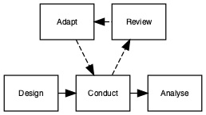

# Adaptive Interventions {#adaptive}

```{r, echo=F, message=F, warning=F}
list_of_packages<-c("tidyverse","diagram","ggpubr","ggalluvial","DiagrammeR","DiagrammeRsvg","rsvg", "knitr", "kableExtra")
new.packages <- list_of_packages[!(list_of_packages %in% installed.packages()[,"Package"])]
if(length(new.packages))install.packages(new.packages,dependencies = TRUE)

library(tidyverse)
library(ggpubr)
library(ggalluvial)
library(diagram)

library(DiagrammeR)
library(DiagrammeRsvg)
library(magrittr)
library(rsvg)

library(kableExtra)
library(knitr)
library(citr)
```
`r include_image("images/logo_alone_new.png")`

<!-- possibly relevant: 
https://pubs.asha.org/doi/full/10.1044/2018_JSLHR-L-RSAUT-18-0029?url_ver=Z39.88-2003&rfr_id=ori%3Arid%3Acrossref.org&rfr_dat=cr_pub++0pubmed
https://ies.ed.gov/ncser/pubs/2020001/pdf/2020001.pdf
https://academy.pubs.asha.org/2013/11/need-for-adaptive-research-designs-in-speech-language-pathology/
https://www.youtube.com/watch?v=ythfdGd63hU

-->
Suppose we have two potential school-based reading interventions for dyslexic children aged 9-11, one computer game that trains sight word recognition and one phonics-based. The lead researcher wishes to test both interventions but has limitations on funding, so can only run one trial rather than two independent trials. The researcher also has some idea that the phonics-based intervention is more likely to be effective than the other. There is a substantial body of literature highlighting significant effect of the phonics intervention but in younger typically developing children, whereas the computer game intervention is novel and relatively untested.

A trial design is proposed that allows both interventions to be run in parallel with the addition of a control group for reference (who receive usual planned teaching); this is known as a three-arm trial (two interventions and a control). The researcher now has a further design decision to make, whether to use a traditional fixed design or an adaptive trial. 

A traditional randomised control trial (without adaption) requires that data are not analysed or "looked at" before data collection is completed. Sample size is calculated to ensure a well powered study given certain assumptions about effect size of interest, type I error rate and power required. The analysis is performed after data collection is complete and results reported. In contrast, the adaptive trial method has the benefit that the intervention can be assessed at multiple points during the recruitment phase of the trial without biasing the results; hence we can make certain adjustments in light of this information.

If we return to our three-arm trial for reading interventions. The researcher has started data collection and has gathered some initial teacher feedback that the novel computer game intervention seems to be hampering progress in those individuals.  In a traditional trial there would be no other course of action but to let the trial run its course and evaluate as planned. This might lead to the computer intervention showing poor results or even having a negative impact on those children, confirming the teacher's concerns. Alternatively, if the researcher had chosen an adaptive design the teacher's observations could have been assessed part way through the trial and the computer based intervention dropped from the study if interim analyses showed a negative impact of the intervention. As a consequence, the remaining individuals could change onto the phonics based intervention if the interim analyses showed positive results.  

```{r flow1, echo=FALSE, include=TRUE,echo=F,message=F,warning=F}

tes1<-DiagrammeR::grViz("
digraph rmarkdown {

node [shape = rectangle,
      fontname = Helvetica,fontsize=8]
      
      Review [label='Review']
      Design1 [label = 'Design']
      Analyse1 [label = 'Analyse']
      Adapt [label = 'Adapt']
      Conduct1 [label = 'Conduct']

Adapt -> Conduct1 [style=dashed]
Conduct1 -> Review [style=dashed]
{rank=same; Design1 -> Conduct1 -> Analyse1};
{rank=same; Adapt -> Review[dir=back,style=dashed]};

}
", height=800)

tes1 %>%export_svg %>% charToRaw %>% rsvg_png("images/flow_16_1.png")
```


```{r adaptiveflow, fig.align="center", fig.height=8,echo=FALSE,fig.cap="Flow diagram of adaptive trial"}

#Not sure why the height and centre commands do not work - altering height in previous chunk also seems to have no effect!
``` 

The adaptive design, as the name suggests, allows for modifications to certain aspects of the design as the trial progresses (see Figure \@ref(fig:adaptiveflow), taken from @pallmann2018). Interim analyses are used to assess whether modifications are required. These pre-planned assessments can be used to make several pre-specified changes, if required. Figure 13.2 [from @thorlund2018] shows some of the commonly used adaptive trial designs, others include: changing the amount or frequency of intervention received, and stopping intervention early if not effective or adverse effects observed.  


```{r adaptivegif, fig.align="center", echo=FALSE,fig.caption="Commonly used adaptive designs"}
knitr::include_graphics("images/adaptive_designs.gif")
``` 
A presentation by @ludlow2013 illustrated the potential of adaptive designs in speech and language therapy. She noted that most trials of swallowing therapies used a similar schedule, regardless of the type of therapy: the patient was seen 1 hour a day for 10 days, giving a total exposure of 10 hours. Alternatively, some outpatient clinics would have patients coming in for one hour per week, for 2-4 weeks. Ludlow suggested that before embarking on a large and costly RCT it would make sense to do adaptive trials to find out what was the optimal schedule - would longer sessions be more effective, or would it be better to have more frequent, shorter sessions? Were there benefits from combining intervention approaches? 

<!--
## More niche trial designs

### Just-in-Time adaptive interventions (JITAI)

### Micro-Randomized Trials (MRT)

### Sequential, Multiple Assignment, Randomized Trial (SMART)
- A review of this approach in the field of autism is provided by @
Kasari, C., Sturm, A., & Shih, W. (2018). SMARTer Approach to Personalizing Intervention for Children With Autism Spectrum Disorder. Journal of Speech, Language, and Hearing Research, 61(11), 2629–2640. https://doi.org/10.1044/2018_JSLHR-L-RSAUT-18-0029

- more general review for education:
Nahum-Shani, I., Almirall, D., & Buckley, J. (2019). An Introduction to Adaptive Interventions and SMART Designs in Education (p. 45). US Department of Education: Institute of Education Sciences.

The Nahum-Shani is a v useful introduction, but I do worry that this approach does just divide people into 'responders' and 'nonresponders' in exactly the way we argued against in chapter 1! - ie assuming measures are perfectly reliable and so can be validly used to subdivide cases.

DB - I think we can either just have a custom block listing these, explaining in one sentence what they are good for, and adding links to places where they are explained, or omit - but I don't know about them so if they could be useful for SLTs we could expan
-->

??EXERCISE FOR THIS CHAPTER
