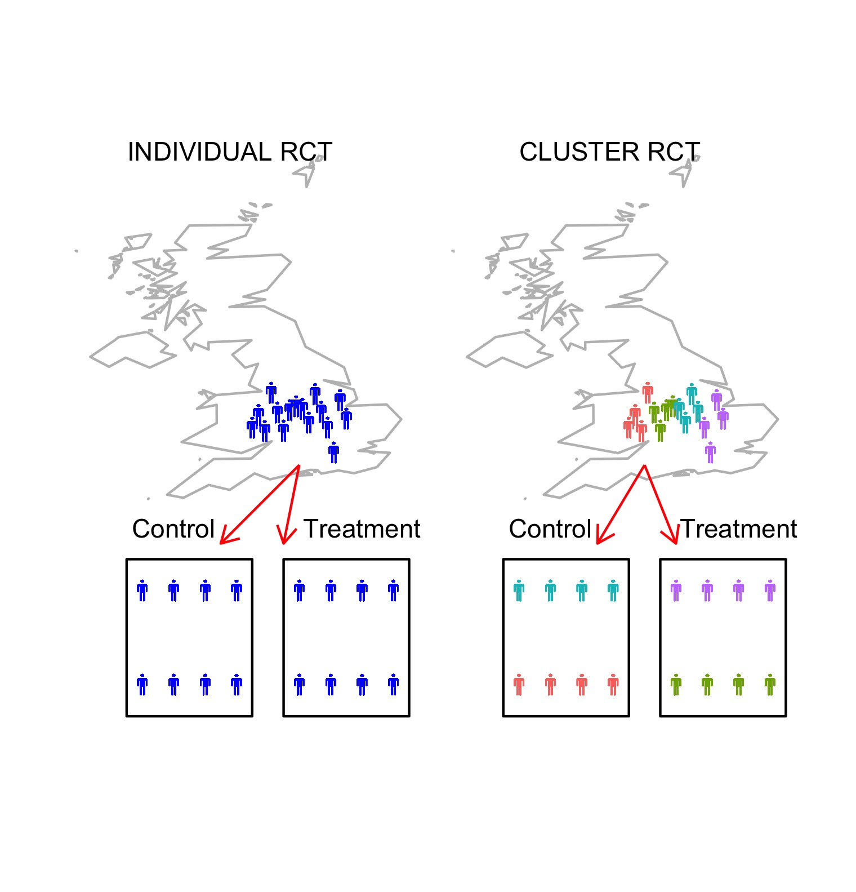

# Cluster Randomised Control Trials {#cluster}

```{r, echo=F, message=F, warning=F}
list_of_packages<-c("tidyverse","diagram","ggpubr","ggalluvial","DiagrammeR","DiagrammeRsvg","rsvg", "knitr", "kableExtra")
new.packages <- list_of_packages[!(list_of_packages %in% installed.packages()[,"Package"])]
if(length(new.packages))install.packages(new.packages,dependencies = TRUE)

library(tidyverse)
library(ggpubr)
library(ggalluvial)
library(diagram)

library(DiagrammeR)
library(DiagrammeRsvg)
library(magrittr)
library(rsvg)

library(kableExtra)
library(knitr)

```
`r include_image("images/logo_alone_new.png")`


## What is a cluster RCT? 

In some situations, allocation of intervention can be problematic due to pragmatic constraints; for example, for a whole-class intervention, it may be disruptive to split students within each class into intervention and control groups. A potential solution is to use cluster trials, where the allocation to intervention is performed at the group level. We can designate clusters that would naturally occur together, for example, school classes, patients under the care of a particular medical practice or a specific therapist, or perhaps by geographic location (county, district or NHS trust). Figure \@ref(fig:cluster-diag) illustrates the logic. 


```{r, cluster-diag,echo=FALSE,warning=F,message=F,fig.cap='In the Individual RCT, location is irrelevant and cases are assigned to intervention at random. In the Cluster RCT, there are four geographical clusters, two of which are randomly assigned to each intervention group'}
  library(ggplot2)
library(ggimage)
library(maptools)
makemaps <- 0 #map is slow to build and so we have saved output in images to read in, unless makemaps is set to 1

if(makemaps==1){


# create a df

set.seed(1)

data(wrld_simpl)
world <- fortify(wrld_simpl)
worldUk <- subset(world, id=="GBR")

d <- data.frame(x = seq(-3,0,0.2),
                y = rnorm(length(seq(-3,0,0.2)),52.5,0.5),
                image = 'images/stickman.png')

d$x2<-d$x+12
worldUk$long2<-worldUk$long+12
d$cluster<-as.factor(rep(1:4,each=4))

polys<-data.frame(id=rep(1:4,each=4),x=c(2,-2,-2,2,-3,-7,-7,-3,9,5,5,9,14,10,10,14),y=c(43,43,48,48,43,43,48,48,43,43,48,48,43,43,48,48))

d2 <- data.frame(x = c(-6.5,-5.5,-4.5,-3.5,-1.5,-0.5,0.5,1.5,-6.5,-5.5,-4.5,-3.5,-1.5,-0.5,0.5,1.5),
                y = c(44,44,44,44,44,44,44,44,47,47,47,47,47,47,47,47),
                image = 'images/stickman.png')

d2$x2<-d2$x+12
d2$cluster<-as.factor(rep(1:4,each=4))

df<-data.frame(x2=c(-4,-2,8,10.5),x1=c(-1.5,-1.5,9.5,9.5),y1=c(51,51,51,51),y2=c(48.5,48.5,48.5,48.5))

# plot2
ggplot() + geom_path(aes(long, lat, group=group), data=worldUk, color="grey", fill=NA) + geom_path(aes(long2, lat, group=group), data=worldUk, color="grey", fill=NA)+coord_equal() + geom_image(data=d,aes(x=x,y=y,image=image), size=.012,color="blue") + geom_image(data=d,aes(x=x2,y=y,image=image,colour=cluster), size=.012) + xlim(-10,15) + ylim(42,61) + geom_polygon(data=polys,aes(x=x,y=y,group=id),colour="black",fill='white') + geom_image(data=d2,aes(x=x,y=y,image=image), size=.012,color="blue") + geom_image(data=d2,aes(x=x2,y=y,image=image,colour=cluster), size=.012) + annotate(geom="text",x=-5.5, y=49, label="Control")+ annotate(geom="text",x=0.5, y=49, label="Treatment")+ annotate(geom="text",x=6.5, y=49, label="Control")+ annotate(geom="text",x=12.5, y=49, label="Treatment")+geom_segment(aes(x = x1, y = y1, xend = x2, yend = y2),colour="red",arrow = arrow(length = unit(0.03, "npc")), data = df)+ annotate(geom="text",x=8.4, y=61, label="CLUSTER RCT") + annotate(geom="text",x=-3.7, y=61, label="INDIVIDUAL RCT")+ theme_nothing()+ theme(legend.position = "none")
}
#NB - DB cropped this manually - if possible, we need to remove extraneous white space by code
if(makemaps==0){
   #read in previously created map
}
```


## Advantages of a cluster design

The first advantage of this approach is logistic. It avoids the practical difficulties of  randomising to intervention within established natural clusters, e.g. splitting classes in schools to different intervention arms, or requiring a therapist to keep track of which cases are allocated to one intervention or another. In addition, if it is necessary to train those administering the intervention, clustering means that fewer individuals need to be trained overall, as those working in each cluster would require training in just one method. 

Another important consideration is that clustering avoids "contamination" effects. Contamination in the context of controlled trials means that individuals in one arm of the trial, say the control arm, have been exposed to the another arm of the trial, say intervention. For example, suppose in the example from the last chapter, within the same classroom we had some children who received a phonics intervention, some who received computerised intervention, and others who just had "business as usual". The children as well as the teachers might feel this is unfair, and indeed they might demand that the control children take part in the other activities. Even if there is no sense of unfairness, a teacher or therapist who is administering two interventions may find it hard to keep them separate. 

In pharmaceutical trials, we can control contamination by masking the randomisation and using placebos that are physically indisinguishable from the drug, so that neither the participant nor the researcher knows who is receiving the intervention. For behavioural interventions, this is not the case, and if participants know one another, then they may readily discover which arm of the trial they are in. The practitioner administering the intervention will also be aware of who is receiving intervention and who is not, and so may treat them differently. The clustered approach minimises the risk of contamination, as intervention clusters are less likely to have direct exposure to each other, and practitioners will consistently do the same intervention with everyone in the study. 

Finally, we may note that any intervention that is administered to a whole group at a time - e.g. a modification to teacher practice that affects all children in the classroom - requires a clustered approach.

## Disadvantages of a cluster design

The benefits of the clustered design are counteracted by some serious disadvantages. First of all, a clustered trial is far less efficient than a regular trial, because the unit of analysis is the cluster rather than the individual. Accordingly, much larger samples are needed to attain adequate power.  

It may not be obvious why clustering should require a different analytic approach, and indeed, the literature does contain trials which have been analysed as if they were regular trials, even though the data are clearly clustered. The problem is that clustering introduces confounds. For instance, if we have classrooms as clusters, then all the children in one class are taught by the same teacher. They are also likely to be more similar within a cluster than between clusters on variables such as social background.  This reduces variability within a cluster. Previously, we have regarded reduced variability as a good thing, as it helps pick out an intervention effect from a background of noise. But in this case, it is a bad thing, because it is confounded with the intervention effect, and may make it seem larger than it is. For instance, if we just had a study where all the children in school A had intervention 1, and all of those in school B had intervention 2, then if we find children in school A did better than those in school B, this is hard to interpret. It could just be that teaching is better in school A, regardless of the intervention. 

Statisticians have developed sophisticated methods of analysis for dealing with the dependency among individuals within the same cluster [@campbell2014]. It is worth taking advice from a statistician if you are contemplating doing such a trial. 

## Classroom exercise
Look at this account of a cluster RCT of "growth mindset" intervention by the Education Endowment Foundation from [this report](https://educationendowmentfoundation.org.uk/public/files/Projects/Evaluation_Reports/Changing_Mindsets.pdf).  The project involved 101 schools and 5018 pupils across England, 
assigned to either intervention or control groups.

<div id="custom">_Pupils were exposed to the mindset theory over a structured series of classes led by their own teachers. The aim of these sessions was to change the way that pupils think about their intelligence, in particular to build high expectations and resilience and to encourage specific plans and goals that emphasise growth, the development of skill, or the expansion of knowledge. The programme was delivered to pupils through eight sessions. These covered themes including the meaning of intelligence, dealing with mistakes and emotions, understanding the brain and encouraging challenge, effort and persistence, stereotypes, and inspirational people. In addition, teachers worked to make the intervention more effective by embedding the growth mindset approach in their everyday class activities, for example, by repeating the message that making mistakes is an opportunity to learn rather than a negative experience._

_Teachers received one day of training that was prepared and delivered by a team of education psychologists from the University of Portsmouth. This training introduced teachers to mindset theory and evidence and provided tips on how to embed the approach in their classrooms/schools (for example, how to communicate incremental beliefs to pupils through feedback and praise). To supplement these suggested changes to everyday practice, teachers were given the materials and training to run an eight-week programme (up to 2.5 hours a week) of weekly lessons and activities with their Year 6 pupils. Specifically, teachers were given a training manual that included comprehensive lesson plans for the eight sessions and a USB stick with additional material to support their interaction with children and their parents. In addition, teachers were granted free access to online videos supplied by the Positive Edge Foundation; these videos were referenced in the lesson plans and teachers were encouraged to use the videos to explain or emphasize particular concepts such as resilience and learning from mistakes. The videos focus on three famous people (Darwin, Einstein, and Wilma Rudolph), describing their lives and how they overcame adversity, in line with the growth mindset message. They included, for example, a video about Charles Darwin’s less-than-promising school performance and a medal-winning athlete who overcame a difficult start in life. Other materials provided by the project team included posters on growth mindset and pupil quizzes._ ˙</div>  

- Why was a cluster RCT method used, rather than a standard two-arm RCT?  

- The results from the trial were disappointing: no evidence of any benefit was found for children who received growth mindset training. Do you think it would be worthwhile to find ways to evaluate the intervention using a non-clustered RCT?  What would be the advantages/challenges of such an approach?  

- The authors of the report suggested various reasons why the trial results were so disappointing. Can you think of what these reasons might be? Would there be any way of checking the plausibility of such explanations. When you have considered this point, look at the discussion of reasons for null results on pp 42-43 of [the report] (https://educationendowmentfoundation.org.uk/public/files/Projects/Evaluation_Reports/Changing_Mindsets.pdf)to see whether you anticipated the points raised there - and whether the report considered the points you thought of.  Note also how the researchers used a "implementation and process evaluation" that made it possible to evaluate different possible explanations (p. 29).   

<!-- other relevant example studies - could we devise an exercise on one of these?:
https://www.sciencedirect.com/science/article/pii/S0885200619301292 - early language curriculum - has numerous data points in longitudinal design
https://journals.plos.org/plosone/article?id=10.1371/journal.pone.0250545 - on health literacy in adolescents
https://trialsjournal.biomedcentral.com/articles/10.1186/s13063-018-3043-3 - this one has only 5 schools in each cluster, but say that they have 80% power?

This one looks v relevant but it's not so easy to find a free version online: Neuman, S. B., Newman, E. H., & Dwyer, J. (2011). Educational effects of a vocabulary intervention on preschoolers word knowledge and conceptual development: A cluster-randomized trial. Reading Research Quarterly, 46(3), 249–272. https://doi.org/10.1598/RRQ.46.3.3

-->

