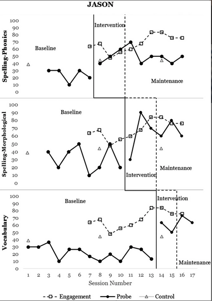
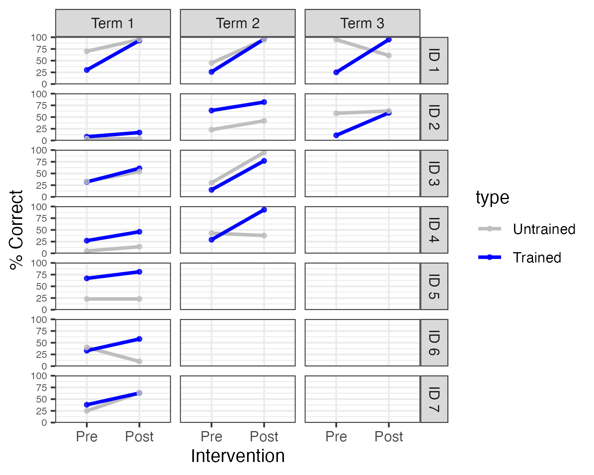

#	Single case designs {#Single}

<!--- This level § heading is NOT RECOGNISED by Bookdown. I have tried cutting out sections of the chapter to identify what causes it to baulk but it is an inconsistent error. We may have to wait and fix this manually at a later stage if we can't get it to work. I can get the level 1 heading to be identified and compile if I just have the first 2 chunks of the chapter, but if I add more it throws inconsistent errors, and the index just misses this chapter. I have tried changing the chapter name. -->

`r include_image("images/logo_alone_new.png")`

```{r message=F,warning=F,echo=FALSE}
library(tidyverse)
library(kableExtra)
library(knitr)
library(ggpubr)
library(ggplot2)
library(forcats)
library(hablar)
```


The single case design, also known as N-of-1 trial, or small N design, is a commonly used intervention design in speech and language therapy, clinical psychology, education, and neuropsychology, including aphasia therapy [@perdices2009]. The single case design may be regarded as an extreme version of a _within-subjects_ design, where two more more conditions are compared within a single person. This type of trial is sometimes dismissed as providing poor quality evidence, but a well-designed single case trial can be an efficient way to obtain an estimate of treatment efficacy in an individual. Very often, a set of single case trials is combined into a *case series* (see below). It is important to note that a single case trial is not a simple case report, but rather a study that is designed and analysed in a way that controls as far as possible for the kind of unwanted influences on results described in chapters 2-5.  

## Logic of single case designs  
Table \@ref(tab:scdlogic) compares the logic of the standard RCT and single case designs.

```{r scdlogic,echo=F,include=T}
options(kableExtra.html.bsTable = T)
Design <- c('RCT: Multiple participants','Single case: Multiple time-points','Single case: Multiple outcomes')
Participants <- c('Yes','-','-')
Time <- c('-','Yes','-')
Outcome <- c('-','-','Yes')
mydf <- data.frame(cbind(Design,Participants,Time,Outcome))
knitr::kable(mydf,escape = F, align = "c", booktabs = T,caption="How intervention vs control is allocated in different study designs") %>%
  kable_styling(c("striped", "bordered"), latex_options = "striped", full_width = F) 

```

The first row of Table \@ref(tab:scdlogic) shows the design for a simple 2-arm RCT, where intervention is varied between participants who are assessed on the same occasion and on the same outcome. The second row shows a version of the single case design where the invention is varied in a single subject at different time points. The third row shows the case where intervention is assessed by comparing treated vs untreated outcomes in the same subject on the same occasion - this is referred to by @krasny-pacini2018 as a multiple baseline design across behaviours and by @ledford2019 as an Adapted Alternating Treatment Design. 

Whatever design is used, the key requirements are analogous to those of the RCT:  

- To minimise unwanted variance (noise) that may mask effects of interest.  
- To ensure that the effect we observe is as unbiased as possible.
- To have sufficient data to reliably detect effects of interest

### Minimising unwanted variance
In the RCT, this is achieved by having a large enough sample of participants to distinguish variation associated with intervention from idiosyncratic differences between individuals, and by keeping other aspects of the trial, such as timing and outcomes, as constant as possible. 

With single case trials, we do not control for variation associated with individual participant characteristics - indeed we are interested in how different people respond to intervention -  but we do need to control as far as possible for other sources of variation. The __ABA__ design is a popular single-case design that involves contrasting an outcome during periods of intervention (B) versus periods of no intervention (A). For example, @armson1998 studied the impact of  frequency-altered auditory feedback on 12 people who stuttered. They contrasted a baseline period (A), a period with auditory feedback (B), and a post-intervention period (A), taking several measures of stuttering  during each period. Figure \@ref(fig:SingleCaseDplot) shows data from two participants during a reading condition. Although the initial amount of stuttering differs for the two individuals, in both cases there is a precipitate drop in stuttering at the 5 minute point corresponding to the onset of the masking, which is sustained for some minutes before gradually rising back towards baseline levels. The baseline period is useful for providing a set of estimates of stuttering prior to intervention, so we can see that the drop in stuttering, at least initially, is outside the range of variation that occurs spontaneously.  


```{r SingleCaseDplot, echo=F, message=F, warning=F, fig.width=8,fig.height=4, fig.cap="Outcome over time in a single case ABA design. Redrawn from digitised data from two participants from Figure 2 of Armson et al (1998)"}

sub1<-read.csv('data/stutterP5_read.csv')
sub2<-read.csv('data/stutterP6_read.csv')
par(mfrow=c(1,2))
df<-sub1
for (i in 1:2){
  if(i==2){df<-sub2}
plot(df$x,df$y,type='b',pch=15,col='blue',main=paste0('Participant ',(i+4)),ylim=c(0,25),ylab='% Stuttering',xlab='Time (mins)')
abline(v=5,lty=2)
abline(v=15,lty=2)
text(2,24.5,"A",cex=1.5)
text(10,24.5,"B",cex=1.5)
text(18,24.5,"A",cex=1.5)
}

```

In the context of neurorehabilitation and speech-and-language therapy, there would appear to be a major drawback of the ABA design. In the course of a historical review of this approach, @mirza2017 described the "N-of-1 niche" as follows:  
  
_"The design is most suited to assessing interventions that act and cease to act quickly. It is particularly useful in clinical contexts in which variability in patient responses is large, when the evidence is limited, and/or when the patient differs in important ways from the people who have participated in conventional randomised controlled trials."_   
  
While the characteristics in the second sentence fit well with speech-and-language therapy interventions, the first requirement - that the intervention should "act and cease to act quickly" is clearly inapplicable. As described in the previous chapter, with few exceptions, interventions offered by those working in education as well as speech and language therapists and those working in other allied health professions are intended to produce long-term change that persists long after the therapy has ended. Indeed, a therapy that worked only during the period of administration would not be regarded as a success. This means that ABA designs, which compare an outcomes for periods with (B) and without (A) intervention, anticipating that scores will go up transiently during the intervention block, will be unsuitable. In this regard, behavioural interventions are quite different from many pharmaceutical interventions, where ABA designs are increasingly being used to compare a series of active and washout periods for a drug. 

Despite this limitation, it is feasible to use an approach where we compare different time periods with and without intervention in some situations, most notably when there is good evidence that the targeted behaviour is unlikely to improve spontaneously. Inclusion of a baseline period, where behaviour is repeatedly sampled before intervention has begun, may give confidence that this is the case. An example of this __multiple baseline__ approach from a study by @swain2020 is discussed below. Where the same intervention can be applied to a group of participants, then a hybrid method known as the __multiple baseline across participants__ design can be used, which combines both between and within-subjects comparisons. A study of this kind by @koutsoftas2009 is discussed in the Class Exercise for this chapter.  

In another kind of single case approach, the __multiple baseline across behaviours__ design, it is the _outcome_ measure that is varied.  This approach is applicable where a single intervention has potential to target several specific behaviours or skills. This gives fields such as speech and language therapy an edge that drug trials often lack: we can change the specific outcome that is targeted by the intervention and compare it with another outcome that acts as a within-person control measure. To demonstrate effectiveness, we need to show that it is the targeted behaviour that improves, while the comparison behaviour remains unaffected.  

For instance, @best2013 evaluated a cueing therapy for anomia in acquired aphasia in a case series of 16 patients, with the aim of comparing naming ability for 100 words that had been trained versus 100 untrained words. By using a large number of words, carefully selected to be of similar initial difficulty, they had sufficient data to  show whether or not there was selective improvement for the trained words in individual participants.  

Figure \@ref(fig:bestplot) is redrawn from data of @best2013. The black points show N items correct on the two sets of items prior to intervention. They were selected to be of similar difficulty and hence they cluster around the dotted line, which shows the point where scores on both item sets are equivalent.  The red points show scores after intervention. Points that fall above the dotted line correspond to cases who did better with trained than untrained words; those below the line did better with untrained than trained words. The red points tend to be placed vertically above the pre-test scores for each individual, indicating that there is improvement after intervention in the trained items (y-axis), but not on control items (x-axis).  

```{r bestplot, echo=F, message=F, warning=F, fig.width=8,fig.height=4, fig.cap="Outcome over time in multiple outcomes design. Reconstructed data from 16 participants, Best et al (2013)"}
bestdf <- read.csv("data/best_data.csv") #from Appendix 5; this is actually both types of item together I think (N=200)
bestdf<-bestdf[1:16,] #remove row 17 - has means
bestdfTpre <- read.csv("data/bestdat1.csv") #digitised from figure 1 in paper
bestdfTpost <- read.csv("data/bestdat2.csv") #digitised from figure 1 in paper

bestdf$tot <- rep(200,16)
bestdf$tot[c(11,15)]<-120 #1 participants with 60 items per condition
bestdf$tothalf<-bestdf$tot/2
bestdf$totNpre <- round(bestdf$tot*bestdf$Pre.therapy.A2,0)
bestdf$totNpost <- round(bestdf$tot*bestdf$Post.therapy.A3,0)
bestdf$Tpre <-  round(bestdf$tothalf*bestdfTpre[,3]/100,0) #100 for all as this is a proportion; this formula gives N in relation to tothalf (which is total N)
bestdf$Tpost <- round(bestdf$tothalf*bestdfTpost[,3]/100,0)
bestdf$Cpre <-bestdf$totNpre-bestdf$Tpre #This is NUMBER, not proportion
bestdf$Cpost <-bestdf$totNpost-bestdf$Tpost #This is NUMBER, not proportion

bestdf$pT <-NA
bestdf$pC <-NA
for (t in 1:2){
  mycols<-c('Cpre','Cpost')
  mydestcol <- 'pC'
  if(t==2){mycols <- c('Tpre','Tpost')
  mydestcol<-'pT'}
bdf<-t(bestdf[,mycols]) #2 cols of interest, transposed

dummy<-data.frame(matrix(100,nrow=1,ncol=2))
for (i in 1:nrow(bestdf)){
  ptest <- prop.test(x=bdf[,i],n=rep(bestdf$tothalf[i],2),alternative = 'less')
  bestdf[i,mydestcol] <- round(ptest$p.value,3)
}
}

#How best to display?
plot(bestdf$Cpre,bestdf$Tpre,ylim=c(0,100),xlim=c(0,100),xlab='N correct untrained words',ylab='N correct trained words',pch=16)
lines(bestdf$Cpost,bestdf$Tpost,type='p',col='red',pch=16)
for(i in 1:nrow(bestdf)){
  segments(bestdf$Cpre[i],bestdf$Tpre[i],bestdf$Cpost[i],bestdf$Tpost[i])
}
abline(a=0,b=1,lty=2)
legend(1, 95, legend=c("Pre-intervention", "Post-intervention"),pch=16,col=c('black','red') ,cex=0.8)

```


Given the large number of items in each set, it is possible to do a simple comparison of proportions to see whether each person's post-intervention score is reliably higher than their pre-intervention score for each item set. For 14 of the 16 cases, there is a statistically significant increase in scores from pre-intervention to post-intervention for target items (corresponding to those with lines that extend vertically above the dotted line), whereas this is the case for only two of the cases when control items are considered (corresponding to cases which show change in the horizontal direction from pre-intervention to post-intervention). 

### Minimising systematic bias  
We have seen in previous chapters how the RCT has evolved to minimise numerous sources of unwanted systematic bias. We need to be alert to similar biases affecting results of single case trials. This is a particular concern for trial designs where we compare different time periods that do or do not include intervention. On the one hand, we may have the kinds of time-linked effects of maturation, practice or spontaneous recovery that lead to a general improvement over time, regardless of the intervention (see Chapter \@ref(nonspecific)), and on the other hand there may be specific events that affect a person's performance, such as life events or illness, which may have a prolonged beneficial or detrimental effect on performance.  

The general assumption of this method is that if we use a sufficient number of time intervals, time-linked biases will average out, but while this may be true for transient environmental effects, such as noise or other distractions, it is not the case for systematic influences that continue over time.  It is important to be aware of such limitations, and it may be worth considering combining this kind of design with other elements that control for time-related biases more effectively (see below).

### The need for sufficient data 
Some early single case studies in neuropsychology may have drawn over-optimistic conclusions because they had insufficient replications of outcome measures, assuming that the observed result was a valid indication of outcome without taking into account error of measurement. For instance, if someone's score improved from 2/10 items correct prior to intervention to 5/10 correct after intervention, it can be hard to draw firm conclusions on the basis of this data alone: the change could just be part of random variability in the measure. The more measurements we have in this type of study, the more confidence we can place in results: whereas in RCTs we need sufficient participants to get a sense of how much variation there is in outcomes, in single case studies we need sufficient observations, and should never rely just a few instances.  

In effect, we need to use the same kind of logic that we saw in Chapter \@ref(power), where we estimated statistical power of a study by checking how likely we would be to get a statistically significant result from a given sample size.  Table \@ref(tab:Nitems-power) shows power to detect a true effect of a given size in a __multiple baseline across behaviours__ design of the kind used by @best2013, where we have a set of trained vs untrained items, each of which is scored either right or wrong. The entries in this table show power, which is the probability that a study would detect a true effect of a given size on a one-tailed test. These entries were obtained by simulating 1000 datasets with each of the different combinations of sample size and effect size.  

The columns show the effect size as the raw difference in proportion items correct for trained vs untrained words. It is assumed that these two sets were equated for difficulty prior to intervention, and the table shows the difference in proportion correct between the two sets after intervention. So if the initial proportion correct was .3 for both trained and untrained items, but after intervention, we expect accuracy on trained items to increase to .6 and the untrained to stay at .3, then the difference between the two sets after treatment is .3, shown in the 4th column of the table.  We can then read down this column to see the point at which power reaches 80% or more. This occurs at the 4th row of the table, when there are 40 items in each set. If we anticipated a smaller increase in proportion correct for trained items of .2, then we would need 80 items per set to achieve 80% power. 


```{r Nitems-power,echo=F,warning=F,message=F}
options(kableExtra.html.bsTable = T)

clist <- seq(.2,.5,.1) #proportions correct in controls
Nitem <- seq(10,200,10)
tlist <- seq(.2,.9,.1)
powerdf <- expand.grid(c=clist,t=tlist,Nitem=Nitem)
powerdf$power<-NA
w<-which(powerdf$c>powerdf$t) #we aren't interested in cases where t is lower than c
powerdf<-powerdf[-w,]
readthisfile <- 1
if(readthisfile == 0){
niter=1000
for(n in 1:nrow(powerdf)){
  N1 <- rbinom(niter,powerdf$Nitem[n],powerdf$t[n])
  N2 <- rbinom(niter,powerdf$Nitem[n],powerdf$c[n])
  N <-powerdf$Nitem[n]
  myp<-vector()
  for (i in 1:niter){
    myp[i]<-prop.test(x=c(N2[i],N1[i]),n=c(N,N),alternative='less')$p.value
  }
  powerdf$power[n] <-length(which(myp<.05))/niter
}

w<-which(powerdf$power>.9)
powerdf$eff<-powerdf$t-powerdf$c

fpowername <- paste0('data/powerprops_nsim',niter,'.csv')


myag <- aggregate(powerdf$power,by=list(powerdf$Nitem,powerdf$eff),FUN=mean)
colnames(myag)<-c('NperSet','Effsize','power')
data_wide <- spread(myag, NperSet, power)
write.csv(data_wide,fpowername,row.names=F)
mytab<-as.data.frame(t(round(data_wide,3)))
mytab<-cbind(row.names(mytab),mytab)
colnames(mytab)<-c('N_per_Set',mytab[1,2:9])
mytab<-mytab[-1,]
row.names(mytab) <- NULL
mytab<-mytab[,1:8]
mytab[2:8]<-round(100*mytab[2:8],0)
mytab<-mytab[,-2]
write.csv(mytab,'data/power_singlecase_itemssets.csv',row.names=F)
}
if(readthisfile==1){
  mytab <- read.csv('data/power_singlecase_itemssets.csv')
}
mytab<-mytab[,1:7]
colnames(mytab)<-c('N_per_Set','.1','.2','.3','.4','.5','.6')
knitr::kable(mytab,escape = F, align = "c", booktabs = T,caption="N items per set needed to detect target-control item difference of a given size") %>%
  kable_styling(c("striped", "bordered"), latex_options = "striped", full_width = F) %>%
  column_spec(c(1), bold = T)

```
## Examples of studies using different types of single case design  
As noted above, single case designs cover a wide range of options, and can vary the periods of observation or the classes of observations made for each individual.  

### A multiple baseline design: Speech and language therapy for adolescents in youth justice.
Figure \@ref(fig:swainfig) from @swain2020 provides an illustration of the multiple baseline design approach. 


```{r swainfig,echo=F,include=T,warning=F,message=F,fig.cap = "Data from one case in the @swain2020 study",out.width="60%"}


```

The three panels show percentages correct on outcome probes for three skills: spelling-phonics, spelling-morphology and vocabulary. These were targeted sequentially in different sessions, and evidence for intervention effectiveness is obtained when a selective increase in performance is shown for the period during and after intervention.  The open squares give a rating of the adolescent's engagement with the intervention, and the open triangles are scores on a nonword repetition task, that was administered intermittently as a control probe, where no improvement was expected. Note that for all three tasks, there is little or no overlap for scores during baseline and those obtained  during and after intervention. The baseline data establish that although targetted behaviours vary from day to day, there is no systematic upward trend in performance until the intervention is administered. Furthermore, the fact that improvement is specific to the behaviour that is targeted in that session gives confidence that this is not just down to some general placebo effect. 

In the other case studies reported by @swain2020, different behaviours were targeted, according to the specific needs of the adolescents who were studied. 

### A study using multiple baseline across behaviours: Effectiveness of electropalatography
We noted in the previous chapter how, electropalatography, a biofeedback intervention that provides information about the position of articulators to help clients improve production of speech sounds, is ill-suited to evaluation in a RCT. It is potentially applicable to people with a wide variety of aetiologies, so the treated population is likely to be highly heterogenous, it requires expensive equipment including an individualised artificial palate, and the intervention is delivered over many one-to-one sessions. The goal of the intervention is to develop and consolidate new patterns of articulation that will persist after the intervention ends. It would not, therefore, make much sense to do a single case trial of electropalatography using an ABA design that involved comparing blocks of intervention vs no intervention. One can, however, run a trial that tests whether there is more improvement on targeted speech sounds than on other speech sounds that are not explicitly treated. 

@leniston2021 applied this approach to seven adolescents with severe speech disorders, all of whom were already familiar with electropalatography. Diagnoses included verbal dyspraxia, structural abnormalities of articulators (velopharyngeal insufficiency), mosaic Turner syndrome, and right-sided hemiplegia. At the start of each school term, two sounds were identified for each case: a target sound, which would be trained, and a control sound, which was also produced incorrectly, but which was not trained. Electropalatography training was administered twice a week in 30 minute sessions. The number of terms where intervention was given ranged from 1 to 3. 

```{r makeebbelsfig,echo=F,include=T,warning=F,message=F}
# Not clear if data should be open here - so we skip this once figure is done
# output of this chunk is not included - we display the saved plot instead
readebbels <-1
if(readebbels==1){
df <- read_csv("data/ebbelsdata.csv")
#turn predictors into factors
df$type <- factor(df$type)
df$time <- factor (df$time)
df$time <- relevel(df$time, "pre-intervention")
df$ID <- factor(df$ID)
df$Term <- factor(df$Term)
df$SLT<-factor(df$SLT)
levels(df$time)<-c("Pre","Post")
levels(df$type)<-c("Untrained","Trained")
#individual plots
eplot<- ggplot(df, aes(x = time, y = score, group = type, linetype=type, colour=type)) +
  geom_smooth(method = "lm", se = FALSE) +
  geom_point(alpha = 0.8, size = 1) +
  xlab("Intervention")+
  ylab("% Correct")+
  facet_grid (ID~Term) +
  theme_bw() +
  theme(axis.text.y = element_text(size=6))+
  scale_linetype_manual( values=c("solid", "solid")) +
  scale_colour_manual (values=c("grey", "blue"))


eplot
ggsave("images/Ebbels.png", units="in", width=5, height=4, dpi=300)
}
```

```{r ebbelsfig,echo=F,include=T,warning=F,message=F,fig.cap = "Individual results for targets and controls at each term (Redrawn Fig 3 from Leniston & Ebbels, data kindly provided by Susan Ebbels)"}


```


An analysis of group data found no main effect of target or time, but a large interaction between these, indicating greater improvement on trained speech sounds. The design of the study made it possible to look at individual cases, which gave greater insights into variation of the impact of intervention. As shown in Figure \@ref(fig:ebbelsfig), in the first term of intervention, there was a main effect of time for three of the participants (IDs 1, 3, and 4), but no interaction with sound type. In other words, these children improved over the course of the term, but this was seen for the untrained as well as the trained sound. By term 2, one of four children showed an interaction between time and sound type (ID4), and both children who continued training into term 3 (ID 1 and 2) showed such an interaction. Three children did not show any convincing evidence of benefit - all of these stopped intervention after one term. 

As the authors noted, there is a key limitation of the study: when a significant interaction is found between time and sound type, this provides evidence that the intervention was effective. But when _both_ trained and untrained sounds improve, this is ambiguous. It could mean that the intervention was effective, and its impact generalised beyond the trained sounds. But it could also mean that the intervention was ineffective, with improvement being due to other factors, such as maturation or practice on the outcome measure.  Inclusion of a series of baseline measures might have helped establish how plausible these two possibilities were. 

In sum, this method can handle the (typical) situation where intervention effects are sustained, but it is most effective if we do not expect any generalisation of learning beyond the targeted behaviour or skill. Unfortunately, this is often at odds with speech and language therapy methods. For instance, in phonological therapy, the therapist may focus on helping a child distinguish and/or produce a specific sound pair, such as [d] vs [g], but there are good theoretical reasons to expect that if therapy is successful, it might generalise to other sound pairs, such as [t] vs [k], which depend on the same articulatory contrast between alveolar vs velar place. Indeed, if we think of the child's phonology as part of a general system of contrasts, it might be expected that training on one sound pair could lead the whole system to reorganise. This is exactly what we would like to see in intervention, but it can make single case studies extremely difficult to interpret. Before designing such a study, it is worthwhile anticipating different outcomes and considering how they might be interpreted. 


### Example of an analysis of case series data
The terms 'single case' and 'N-of-1' are misleading in implying that only one participant is trained. More commonly, studies assemble a series of N-of-1 cases. Where the same intervention is used for all cases, regular group statistics may be applied. But unlike in RCTs, heterogeneity of response is expected and needs to be documented. In fact, in a single case case series, the interest is less in whether an overall intervention effect is statistically significant, as in whether the data provide evidence of individual variation in response to intervention, as this is what would justify analysis of individual cases. Formally, it is possible to test whether treatment effects vary significantly across participants by comparing a model that does or does not contain a term representing this effect, using [linear mixed models](https://stackoverflow.com/questions/24019807/how-to-compare-a-model-with-no-random-effects-to-a-model-with-a-random-effect-us), but we would recommend that researchers consult a statistician, as those methods are complex and require specific types of data. In practice, it is usually possible to judge how heterogeneous responses to intervention are by inspecting plots for individual participants.  

Typically the small sample sizes in N-of-1 case series preclude any strong conclusions about the characteristics of those who do and do not show intervention effects, but results may subsequently be combined across groups, and specific hypotheses formulated about the characteristics of those who show a positive response.


An example comes from the study by @best2013 evaluating rehabilitation for anomia in acquired aphasia. As described above, researchers contrasted naming ability for words that had been trained, using a cueing approach, versus a set of untrained control words, a multiple baseline across behaviours design. In general, results were consistent with prior work in showing that improvement was largely confined to trained words. As noted above, this result allows us to draw a clear conclusion that the intervention was responsible for the improvement, but from a therapeutic perspective it was disappointing, as one might hope to see generalisation to novel words.  

The authors subdivided the participants according to their language profiles, and suggested that improvement on untrained words was seen in a subset of cases with a specific profile of semantic and phonological strengths. This result, however, was not striking and would need to be replicated.


<!--- the literature seems pretty murky here. There was an early paper by Howard that talked about analysing homogeneity in case series, which seems an interesting idea, but I'm not sure how valid his approach is: Howard, D. (2003). Chapter 16: Single Cases, Group Studies and Case Series in Aphasia Therapy. In The Sciences of Aphasia: From Theory to Therapy. Ilias Papathanasiou and Ria De Bleser (Eds). (pp. 245–258). Elsevier. https://doi.org/10.1016/B978-008044073-6/50017-1
https://reader.elsevier.com/reader/sd/pii/B9780080440736500171?token=402044775314B107D8FAC186B5A72020B85191FCEE862FCF95B2C037B17634D20F97DB7AFB2A1723513D3FCC21D586D4&originRegion=eu-west-1&originCreation=20210801103239.-->


### Combining approaches to strengthen study design

In practice, aspects of different single-case designs can be combined - e.g. the cross-over design by @varley2016 that we described in Chapter \@ref(crossover) compared an intervention across two time points and two groups of participants, and also compared naming performance on three sets of items: trained words, untrained words that were phonemically similar to the trained words, and untrained words that were dissimilar to the trained words. Furthermore, baseline measures were taken in both groups to check the stability of naming responses. That study was not, however, analysed as a single case design: rather the focus was on average outcomes without analysing individual differences.  However, the inclusion of multiple outcomes and multiple time points meant that responses of individuals could also have been investigated.


## Statistical approaches to single case designs

Early reports of single case studies often focused on simple visualisation of results to determine intervention effects, and this is still a common practice [@perdices2009]. This is perfectly acceptable provided that differences are very obvious, as in Figure \@ref(fig:SingleCaseDplot) above. We can think back to our discussion of analysis methods for RCTs: the aim is always to ask whether the variation associated with differences in intervention is greater than the variation within the intervention condition. In Figure \@ref(fig:SingleCaseDplot) there is very little overlap in the values for the intervention vs non-intervention periods, and statistics are unnecessary.  However, results can be less clearcut than this. Figure \@ref(fig:SingleCaseDplot2) shows data from two other participants in the study by @armson1998, where the evidence of an intervention effect is much less clearcut. 

```{r SingleCaseDplot2, echo=F, message=F, warning=F, fig.width=8,fig.height=4, fig.cap="Outcome over time in a single case ABA design. Digitised data from two participants from Figure 2 of Armson et al (1998)"}

sub1<-read.csv('data/stuttering_read_P11.csv')
sub2<-read.csv('data/stuttering_read_P12.csv')
par(mfrow=c(1,2))
df<-sub1
for (i in 1:2){
  if(i==2){df<-sub2}
plot(df$x,df$y,type='b',pch=15,col='blue',main=paste0('Participant ',(i+10)),ylim=c(0,25),ylab='% Stuttering',xlab='Time (mins)')
abline(v=5,lty=2)
abline(v=15,lty=2)
text(2,24.5,"A",cex=1.5)
text(10,24.5,"B",cex=1.5)
text(18,24.5,"A",cex=1.5)
}

```

Unfortunately, rather than a well-worked-out set of recommendations for statistical analysis of single case trials, there is a plethora of methods in use, which can be challenging, or even overwhelming, for anyone starting out in this field to navigate. Furthermore, most of the focus has been on ABA and related designs, with limited advice on how to deal with designs that use comparisons between treated and untreated outcomes. 


## Overview of considerations for single case designs

In most of the examples used here, the single case design could be embedded in natural therapy sessions,  include heterogeneous participants, and be adapted to fit into regular clinical practice. This makes the method attractive to clinicians, but it should be noted that while incorporating evaluation into clinical activities is highly desirable, it often creates difficulties for controlling aspects of internal validity. For instance, in the study by @swain2020, the researchers noted an element of unpredictability about data collection, because the young offenders that they worked with might either be unavailable, or unwilling to take part in intervention sessions on a given day.  In the @leniston2021 study the target and control probes were not always well-matched at baseline, and for some children, the amount of available data was too small to give a powerful test of the intervention effect. Our view is that it is far better to aim to evaluate interventions than not to do so, provided limitations of particular designs are understood and discussed. Table \@ref(tab:singlecasechart) can be used as a checklist against which to assess characteristics of a given study, to evaluate how far internal validity has been controlled. 


```{r singlecasechart, echo=F, include=T,tab.cap="How single case designs deal with threats to study validity"}
require(flextable)
Biases <- c('Spontaneous improvement','Practice effects','Regression to the mean','Noisy data (1)','Noisy data (2)','Selection bias', 'Placebo effects', 'Experimenter bias (1)','Experimenter bias (2)','Biased drop-outs','Low power','False positives due to p-hacking')
Remedies <- c('Control outcome and/or baseline time period','Control outcome and/or baseline time period','Control outcome and/or baseline time period','Baseline period to establish variability','Outcomes with low measurement error','NA','-','Record sessions','Strictly specified protocol','Report on the number and characteristics of drop-outs','A priori power analysis; need for many observations','Registration of trial protocol')

mydf<-data.frame(cbind(Biases,Remedies))
ftable<-flextable(mydf)
ftable <- set_caption(ftable, "How single case designs deal with threats to study validity")
ftable <- autofit(ftable)
ftable
```
We are not aware of specific evidence on this point, but it seems likely that the field of single case studies, just like other fields, is likely to suffer from problems of publication bias (Chapter \@ref(Pubbias)), whereby results are reported when an intervention is successful, but not when it fails. If studies are adequately powered - and they should be designed so that they are - then all results should be reported, including those which may be ambiguous or unwanted, so that we can learn from what doesn't work, as well as from what does.  

A final point, which cannot be stressed enough, is that when evaluating a given intervention, a single study is never enough. Practical constraints usually make it impossible to devise the perfect study that gives entirely unambiguous results: rather we should aim for our studies to reduce the uncertainty in our understanding of the effectiveness of intervention, with each study building on those that have gone before. With single case studies, it is common to report the raw data in the paper, in either numeric or graphical form, and this is particularly useful in allowing other researchers to combine results across studies to form stronger conclusions (see Chapter \@ref(litrev)). 


## Class exercise  

1. @koutsoftas2009 conducted a study of effectiveness of phonemic awareness intervention with a group of children who showed poor sound awareness after receiving high quality whole-classroom teaching focused on this skill. Intervention sessions were administered by speech-language pathologists or experienced teachers to 13 groups of 2-4 children twice per week for a baseline and post-intervention period, and once per week during the 6 week intervention. Active intervention was preceded by a baseline period - one week (with two outcome measurement points) for seven groups of children, and two weeks (4 measurement points) for the other six groups. Outcome probes involved identifying the initial sound from a set of three words in each session. The researchers reported effect sizes for individual children that were calculated by comparing score on the probes in the post-intervention period with those in the baseline period, showing that most children showed significant gains on the outcome measure.  Group results on the outcome measure (redrawn from Table 2 of the paper) are shown in Figure \@ref(fig:kdataplot).  


```{r kdataplot, echo=FALSE,message=FALSE,warning=FALSE,fig.cap="Group means from Koutsoftas et al, 2009. Filled points show intervention phase, unfilled show baseline or post-intervention"}

kdf <- read.csv("data/koutsoftas_data.csv")

#need to convert to long form
klong <- gather(kdf, Time, Outcome, S1:S12, factor_key=TRUE)
klong$Group <- as.factor(klong$Group)
levels(klong$Time)<-1:12 #remove initial S, so hablar will work
klong$TimeNum <- hablar::retype(klong$Time) #need to have time as numeric rather than factor

klong$pch <-1 #default pch is open circle, for post intervention
klong$row<-1:nrow(klong)
myf <- filter(klong,Group==1,TimeNum<9)
klong$pch[myf$row]<-15 #filled circle
myf <- filter(klong,Group==2,TimeNum<11)
klong$pch[myf$row]<-15
myf <- filter(klong,Group==1,TimeNum<3)
klong$pch[myf$row]<-2 #open sq
myf <- filter(klong,Group==2,TimeNum<5)
klong$pch[myf$row]<-2

kmean<-aggregate(klong$Outcome, by=list(klong$Time,klong$Group),FUN=mean)
colnames(kmean)<-c('Session','Group','Outcome')
#ggplot(data=kmean,aes(x = Session, y = Outcome, group = Group)) + geom_line(aes(colour=Group),alpha=0.5) +
#    geom_point(aes(colour=Group),alpha=0.5) + theme_bw()


#?? doesn't look like plot in the paper
# try means computed from excel
# Have written to query with authors: current email: anthony.koutsoftas@shu.edu; Mary.Harmon@nau.edu; shelley.gray@asu.edu
G1<-c(0.357142857,	0.071428571,	0.285714286,	0.214285714,	0.428571429,	0.5,	1.071428571,	0.785714286,	1.928571429,	2,	2.214285714,	2.428571429)
G2 <- c(0.05,	0.05,	0.2,	0.25,	0.6,	0.75,	1.25,	1.4,	1.55,	1.65,	1.6,	1.8)

G1p <- c(1,1,15,15,15,15,15,15,2,2,2,2)
G2p <- c(1,1,1,1,15,15,15,15,15,15,2,2)

plot(G1,type='b',main='Probe scores for staggered intervention groups',xlab='Measurement',ylab='Mean number correct /3',ylim=c(0,3),col="darkgrey",pch=G1p)
text(1.4,2.9,'Baseline',cex=.7,col="darkgrey")
text(5.8,2.8,'Intervention',cex=.7,col="darkgrey")
text(11,2.9,'Post',cex=.7,col="darkgrey")
arrows(0.5, 2.8, 2, 2.8,col='darkgrey',code=3,length=.1)
arrows(3, 2.7, 8, 2.7,col='darkgrey',code=3,length=.1)
arrows(9, 2.8, 12, 2.8,col='darkgrey',code=3,length=.1)

lines(G2,type='b',xlab='Session',ylab='Mean number correct /3',ylim=c(0,3),col='blue',pch=G2p)

text(2.4,2.6,'Baseline',cex=.7,col="blue")
text(6.8,2.5,'Intervention',cex=.7,col="blue")
text(11.5,2.6,'Post',cex=.7,col="blue")
arrows(0.5, 2.5, 4, 2.5,col='blue',code=3,length=.1)
arrows(5, 2.4, 10, 2.4,col='blue',code=3,length=.1)
arrows(11, 2.5, 12, 2.5,col='blue',code=3,length=.1)

grid(NULL,NULL, col = "gray", lty = "dotted")


```

Consider the following questions about this study.  
a. What kind of design is this?  
b. How well does this design guard against the biases shown in Table \@ref(tab:singlecasechart)?  
c. Could the fact that intervention was delivered in small groups affect study validity? (Clue: see Chapter \@ref(cluster)).  
d. If you were designing a study to follow up on this result, what changes might you make to the study design?  
e. What would be the logistic challenges in implementing these changes?
 
2. The SCRIBE guidelines have been developed to improve reporting of single case studies in the literature. An article by @tate2016 describing the guidelines with explanation and elaboration is available [here](https://psycnet.apa.org/fulltext/2016-17382-001.html), with a shorter article summarising the guidelines [here](https://academic.oup.com/ptj/article/96/7/e1/2864911).  
Identify a single case study in the published literature in your area and check it against the guidelines to see how much of the necessary information is provided.  
This kind of exercise can be more useful than just reading the guidelines, as it forces the reader to read an article carefully and consider what the guidelines mean.  

3. In the previous chapter, we described a study by @calder2021, which used a cross-over design to evaluate the effect of an intervention designed to improve grammatical morphology. This study also included probes to test mastery of untrained morphological endings. The trained structure was past tense -ed; a 'generalisation' probe was another verb ending, 3rd person singular -s, and a control probe was possessive -s. Before studying Figure \@ref(fig:Calderplus) make a note of your predictions about what you might expect to see with these additional probes. Once you have studied the Figure, consider whether you think the inclusion of the probes has strengthened your confidence in the conclusion that the intervention is effective.  

```{r Calderplus, echo=F,fig.cap = "Mean % correct for all 3 probes in delayed cross-over study by Calder et al, 2021 (data plotted from Calder et al's Table 2)."}


cdat <- read.csv("data/Calder/calder_xover.csv")
wantrows <- c(1,5,7,9,13,15)
cdat <-cdat[wantrows,]
#reorder cols to facilitate conversion
cdatwide <- cdat[,c(1,2,3,5,7,9,11,13,15,4,6,8,10,12,14,16)]
clong <- gather(cdatwide, phase, measurement, T1:T7, factor_key=TRUE)
clong$OutcomesGroup <-paste0(clong$Group,clong$Outcomes)
clong$OutcomesGroup<-as.factor(clong$OutcomesGroup)
clong$Outcomes <- as.factor(clong$Outcomes)
clong$phase <- as.factor(clong$phase)
levels(clong$phase)=1:7
clong$Group <- as.factor(clong$Group)

  
 #Try with base R!
plot(1, type = "n",                         # Remove all elements of plot
     xlab = "Phase", ylab = "% Correct",
     xlim = c(1, 7), ylim = c(0, 80))
mycols <- c('blue','red')
mylines <- c(1,2,3)
mypch<-c(2,0,19)
vpos<-c(75,10)
hpos <-c(4.5,6.4)
 for (g in 1:2){
    thisdat<-clong[clong$Group==g,]
    for (o in 1:3){  #all 3 probes
       plotdat<-thisdat[thisdat$Outcomes==levels(clong$Outcomes)[o],]
       plotdat<-plotdat[!is.na(plotdat$measurement),]
       lines(x=plotdat$phase,y=plotdat$measurement,col=mycols[g],lty=mylines[o],type='b',pch=mypch[o])
    }
    text(1.5,vpos[g],paste0("Group ",g,":\n baseline"),col=mycols[g])
    text(hpos[g],vpos[g],paste0("Group ",g,":\n post-intervention"),col=mycols[g])
 }
segments(1,68,2,68,col='blue',lwd=2)
segments(1,3,4,3,col="red",lwd=2)

# Add a legend
legend("topright",
  legend = c("past -ed","3rd pers -s","possessive 's"),
  pch = c(19,0,2),
  inset = c(0.01, 0.01))
```


